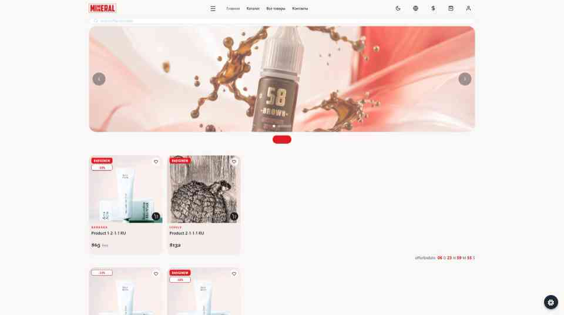

# AI Debug Report - 2026-07-25_14-46-56

## 📊 Environment & Diagnostics
| Parameter | Value |
| :--- | :--- |
| **URL** | [http://localhost:8081/](http://localhost:8081/) |
| **User Agent** | `Mozilla/5.0 (Windows NT 10.0; Win64; x64) AppleWebKit/537.36 (KHTML, like Gecko) Chrome/149.0.0.0 Safari/537.36` |
| **Viewport Size** | 1920x1073 (PixelRatio: 1) |
| **Screen Resolution** | 1920x1200 |
| **Network** | Online: `true`, Type: `4g` |
| **DOM Size** | 259 elements |

## 🖼️ Screenshot


## 📂 Quick Links
* [Open Full Screenshot](file:///D:/Magazine/_PigmentShop/.browserLog/screenshots/screenshot_2026-07-25_14-46-56.jpg)
* [Open Raw State JSON](file:///D:/Magazine/_PigmentShop/.browserLog/state/state_2026-07-25_14-46-56.json)

## 📜 Console Warnings & Errors (Recent 0)
| Timestamp | Type | Message |
| :--- | :--- | :--- |
| | N/A | No warnings or errors logged | |

## 📦 Application State Dump
```json
{
  "url": "http://localhost:8081/",
  "userAgent": "Mozilla/5.0 (Windows NT 10.0; Win64; x64) AppleWebKit/537.36 (KHTML, like Gecko) Chrome/149.0.0.0 Safari/537.36",
  "screen": {
    "viewportWidth": 1920,
    "viewportHeight": 1073,
    "devicePixelRatio": 1,
    "width": 1920,
    "height": 1200
  },
  "network": {
    "online": true,
    "effectiveType": "4g"
  },
  "dom": {
    "elementCount": 259
  },
  "history": {
    "length": 2
  },
  "storage": {
    "localStorage": {
      "cart_items": "{\"__v\":1,\"data\":[]}"
    },
    "sessionStorage": {
      "cart_items": "{\"__v\":1,\"data\":[]}"
    }
  },
  "state": {
    "auth": {
      "isLoggedIn": false,
      "user": null
    },
    "cart": {
      "items": [],
      "totalCount": 0
    },
    "favorites": {
      "items": []
    },
    "language": {},
    "theme": {
      "isDark": false
    }
  }
}
```
