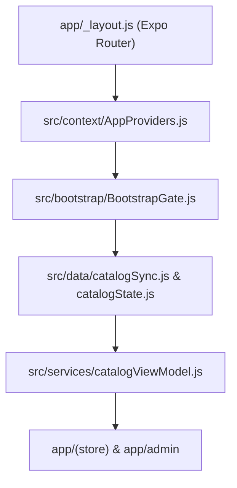

# Architecture Discovery Audit

> [!NOTE]
> This read-only architectural audit evaluates system structure, domain boundary definitions, dependency flow, state management, and technical debt across the PigmentShop codebase.

---

## 1. Executive Summary

PigmentShop exhibits a well-structured domain layer and explicit initialization flow using React Native Web and Expo Router. Key architectural strengths include formal service contracts, strict bootstrap gates, and tokenized styling. However, technical debt exists in presentation component sizes, state sync coupling between React Context and raw external stores (`useSyncExternalStore`), and feature folder boundary leakages.

---

## 2. Architecture Overview

The system uses a layered architecture:
1. **Routing Shell**: Expo Router directory routing (`app/`).
2. **Context & Provider Hierarchy**: Modular composition in [AppProviders.js](file:///d:/Magazine/_PigmentShop/src/context/AppProviders.js).
3. **Bootstrap Layer**: Lifecycle orchestration step contract in [bootstrapOrchestrator.js](file:///d:/Magazine/_PigmentShop/src/bootstrap/bootstrapOrchestrator.js).
4. **Data & ViewModel Layer**: In-memory external reactive store using `useSyncExternalStore` combined with domain transform utilities.

---

## 3. Folder Analysis

| Folder | Intended Responsibility | Structural Evaluation |
| :--- | :--- | :--- |
| `src/bootstrap` | Initialization gates & startup orchestration | **Clean**: Explicit lifecycle contract and step dependencies. |
| `src/context` | Application-wide state distribution | **Moderate**: Mixes pure global UI state with domain view models. |
| `src/services` | External data access & business logic transforms | **Leaky**: Contains state management helpers along with raw API wrappers. |
| `src/domain` | Business domain rules & contracts | **Underused**: Contains single TypeScript contract; domain rules leak into services. |
| `src/features` | Modular feature UI and domain bundles | **Inconsistent**: Shell feature wrappers coexist with standalone root pages. |
| `src/hooks` | Reusable stateful visual and business logic | **High Cohesion**: Split between UI animations and view data adapters. |

---

## 4. Dependency Analysis

- **Directional Flow**: Clean unidirectional data flow from low-level data stores (`src/data/`) to view models (`src/services/catalogViewModel.js`), React Contexts, and UI views.
- **Cyclic Import Risks**: No explicit circular dependencies detected; `useSyncExternalStore` isolates data notifications from React tree updates.
- **Layer Violations**: Presentation components occasionally bypass custom domain hooks to import raw transformation helpers directly.

---

## 5. Components

- **Multi-Responsibility Containers**: Large screens (e.g. Catalog grid views) handle layout, sorting state, responsive layout math, and modal visibility simultaneously.
- **UI Primitives vs Features**: Base UI primitives (`src/components/`) are well isolated from admin presentation elements (`src/components/Admin/`).

---

## 6. Hooks

- **Reusable UI Hooks**: `useAnimatedTransition`, `useGridLayout`, `useHoverAnimation`, and `useFormModal` demonstrate high reusability.
- **Feature/View Hooks**: `useCatalogViewData`, `useLoginForm`, and `useHomeScrollHide` encapsulate screen-specific orchestration effectively.

---

## 7. Services

- **Responsibility Coupling**: `catalogViewModel.js` and `adminCatalogState.js` combine cache normalization, indexing, and state subscription logic within single files.
- **Service Conventions**: [SERVICE_CONVENTIONS.md](file:///d:/Magazine/_PigmentShop/src/services/SERVICE_CONVENTIONS.md) enforces standardized async responses and error boundaries.

---

## 8. Context Providers

- **Provider Tree**: Structured in 3 distinct tiers in [AppProviders.js](file:///d:/Magazine/_PigmentShop/src/context/AppProviders.js) (Core Infrastructure $\rightarrow$ Session/Catalog $\rightarrow$ User Features).
- **Overuse Assessment**: `CatalogContext` performs CPU-bound index building on raw store updates; memoization mitigates unnecessary render cascades.

---

## 9. Bootstrap & State Management

- **Initialization Flow**: Driven by `STARTUP_STEPS` in `startupContract.js` and managed via `BootstrapGate.js`.
- **State Strategy**: Hybrid architecture using external reactive stores (`catalogState.js`) synced into React Context via `useSyncExternalStore`.

---

## 10. Technical Debt

1. **Mixed Domain Logic**: Business rules scattered between `src/services/` and `src/context/` instead of `src/domain/`.
2. **Duplicated Form Logic**: Overlapping validation and field handlers across `useForm.js`, `useLoginForm.js`, and `useCartViewForm.js`.
3. **Incomplete Feature Encapsulation**: Feature directories contain partial components while remaining routes stay in `app/`.

---

## 11. Strengths

1. **Clear Provider Composition**: Zero provider nesting mess at root level.
2. **Robust Startup Lifecycle**: Formal startup contract with explicit dependency ordering and failure semantics.
3. **Decoupled Data Store**: Fast UI rendering using external stores + `useSyncExternalStore`.

---

## 12. Priority Improvements

1. **Centralize Domain Entities**: Shift transform and validation logic from `src/services/` into dedicated `src/domain/` models.
2. **Consolidate Form Hooks**: Unify `useForm`, `useLoginForm`, and `useCartViewForm` into a single validation-backed form engine.
3. **Decouple Catalog Indexing**: Move search index computation out of `CatalogContext` render loop into a background worker or lazy selector.
4. **Standardize Feature Folders**: Migrate route-specific components into their matching `src/features/<domain>` module.
5. **Tighten Service Layer Boundaries**: Separate state holding from pure network services in `adminCatalogState.js`.

---

## 13. Overall Assessment

| Metric | Score (1-10) | Explanation |
| :--- | :---: | :--- |
| **Architecture & Layering** | **8 / 10** | Clear separation between routing, state providers, and background data sync. |
| **Separation of Concerns** | **7 / 10** | Presentation logic is clean, but data transforms leak between context and services. |
| **State Management** | **8 / 10** | Modern `useSyncExternalStore` pattern prevents context re-render bloat. |
| **Maintainability** | **7 / 10** | Modular hooks mitigate component complexity; domain layer needs centralization. |
| **Overall Score** | **7.5 / 10** | Solid engineering foundation with minor refactoring needed around domain boundaries. |
