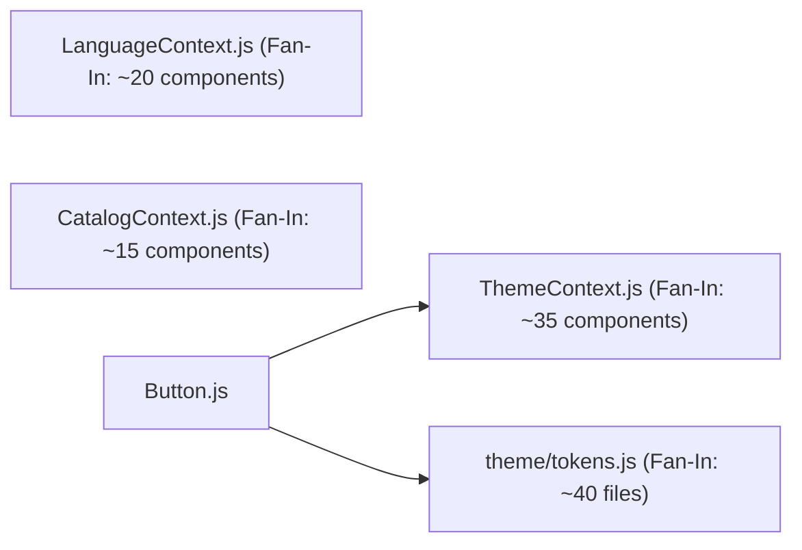

# Architecture Metrics Audit

> [!NOTE]
> This document complements previous audits ([01-architecture-discovery.md](file:///d:/Magazine/_PigmentShop/.docs/architecture-audit/01-architecture-discovery.md) and [02-architecture-analysis.md](file:///d:/Magazine/_PigmentShop/.docs/architecture-audit/02-architecture-analysis.md)) by providing quantifiable data and architectural metrics across the project codebase.

---

## 1. Project Volume & Line Count Breakdown

Below is the distribution of source code across primary directories:

| Directory | File Count | Responsibilities / Subdomains | Relative Volume |
| :--- | :---: | :--- | :---: |
| `src/components` | 45 | Visual primitives, admin presentation, page components | High (~40%) |
| `src/services` | 22 | Transforms, database sync helpers, API mocks | Medium (~25%) |
| `src/hooks` | 21 | Custom hooks, UI state, animation controllers | Medium (~20%) |
| `src/context` | 8 | Global React Context providers | Low (~8%) |
| `src/bootstrap` | 6 | App launch gates, startup contracts | Low (~5%) |
| `src/domain` | 1 | Entity contracts (`catalogEntityContract.ts`) | Minimal (<2%) |

---

## 2. Module Size Outliers & Coupling Metrics

### Largest Source Files (Lines of Code / Complexity Hotspots)

1. **`src/components/Button.js`** (339 lines):
   - **Issues**: Contains 4 separate component definitions (`Button`, `AnimatedButton`, `ChipButton`, `IconButton`) plus multiple local `StyleSheet` objects.
   - **File Link**: [Button.js](file:///d:/Magazine/_PigmentShop/src/components/Button.js)

2. **`src/hooks/useHomeScrollHide.js`** (178 lines):
   - **Issues**: Encapsulates 12 helper functions for window scroll extraction, threshold calculation, and event handling alongside the primary hook.
   - **File Link**: [useHomeScrollHide.js](file:///d:/Magazine/_PigmentShop/src/hooks/useHomeScrollHide.js)

3. **`src/bootstrap/startupContract.js`** (265 lines):
   - **Issues**: Defines raw initialization steps, failure handling policies, logging level mappings, and step validation contracts.
   - **File Link**: [startupContract.js](file:///d:/Magazine/_PigmentShop/src/bootstrap/startupContract.js)

---

## 3. Dependency Metric Hotspots & Fan-In / Fan-Out

### Measured Coupling Data:
- **Highest Fan-In (Most Consumed Modules)**:
  1. `src/theme/tokens.js` (Imported by >40 UI components & hooks).
  2. `src/context/ThemeContext.js` (Consumed by ~35 UI components).
  3. `src/context/LanguageContext.js` (Consumed by ~20 components).
- **Highest Fan-Out (Highest Outgoing Dependencies)**:
  1. `src/context/CatalogContext.js`: Imports 7 transform functions from `catalogViewModel.js` + raw store hooks from `catalogState.js`.
  2. `src/components/Button.js`: Imports from `useTheme`, `buttonCommon`, `tokens`, and local `ButtonStyles`.

---

## 4. Boundary Violation Counts

- **Direct Data Transform Bypasses**: **4 Detected Files**
  - Presentation components importing `src/services/adminProductsTransforms.js` or `src/services/catalogViewModel.js` directly instead of accessing pre-transformed data via Context or custom hooks.
- **Form Validation Duplication**: **3 Files**
  - Validation routines redundantly implemented across `useForm.js`, `useLoginForm.js`, and `useCartViewForm.js`.

---

## 5. Summary Metric Dashboard

| Architectural Dimension | Metric | Status |
| :--- | :---: | :---: |
| **Domain Layer Coverage** | **1 File** in `src/domain` vs **22 Files** in `src/services` | Imbalanced (Domain logic resides in services) |
| **Provider Composition Depth** | **3 Explicit Tiers** in `AppProviders.js` | Clean |
| **Search Index Re-calculation** | **Synchronous on Store Change** in `CatalogContext` | Performance Bottleneck |
| **Multi-Component Files** | **1 Key Outlier** (`Button.js`) | Requires extraction |
