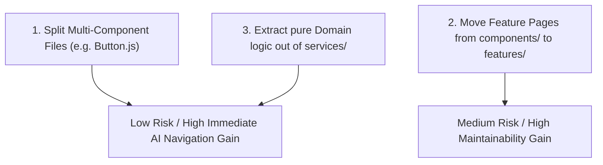

# Architecture Migration Assessment

> [!NOTE]
> This evaluation determines whether reorganizing PigmentShop around modular feature boundaries provides measurable ROI, balancing migration risks against long-term maintenance gains.

---

## 1. Where the Current Structure Works Well

1. **Explicit Startup Contract**:
   - `src/bootstrap/` ([bootstrapOrchestrator.js](file:///d:/Magazine/_PigmentShop/src/bootstrap/bootstrapOrchestrator.js)) successfully encapsulates app launch logic and failure semantics.
2. **Provider Composition**:
   - `src/context/AppProviders.js` provides clean tiering of infrastructure, session, and user feature contexts without provider nesting clutter.
3. **Reactive External State Sync**:
   - `src/data/catalogState.js` coupled with `useSyncExternalStore` in `CatalogContext` effectively decouples network data updates from unnecessary UI render cascades.

---

## 2. Where Responsibilities Are Fragmented

1. **Split Storefront Feature UI**:
   - Feature views like `CartView.js`, `CatalogPage.js`, and `ProductPage.js` reside in generic `src/components/`, while `auth`, `orders`, and `profile` have dedicated subdirectories in `src/features/`.
2. **Service Layer Overloading**:
   - Services in `src/services/` mix raw database calls, state mutation helpers (`adminCatalogState.js`), and view model transformations (`catalogViewModel.js`).

---

## 3. High-Value Migration Targets vs Risk Impact

### Impact & Cost Analysis:

- **Target 1: Modularize Outlier Files (`Button.js`)**:
  - *Migration Cost*: Very Low (Extract `ChipButton` and `IconButton` to separate files).
  - *Benefit*: High (Eliminates single-file bloat and simplifies symbol lookups).
- **Target 2: Complete `src/features/` Re-organization**:
  - *Migration Cost*: Medium (Requires updating import paths in Expo Router pages under `app/`).
  - *Benefit*: High (Establishes uniform feature-folder architecture across all storefront pages).
- **Target 3: Refactor Service/Domain Split**:
  - *Migration Cost*: Low-Medium (Move pure view model functions into `src/domain/catalog/`).
  - *Benefit*: Medium (Clean architectural boundaries).

---

## 4. Final Migration Recommendation & ROI Verdict

> [!TIP]
> **Verdict: Incremental Migration Recommended (Phased Approach)**

Full immediate restructuring is **unnecessary and risky** due to existing codebase stability. However, an **incremental 3-step migration** is strongly recommended:
1. **Phase 1**: Extract multi-component files (`Button.js`) to dedicated component folders.
2. **Phase 2**: Relocate storefront feature screens (`CatalogPage.js`, `CartView.js`) into `src/features/`.
3. **Phase 3**: Move pure data transformations from `src/services/catalogViewModel.js` into `src/domain/catalog/`.
