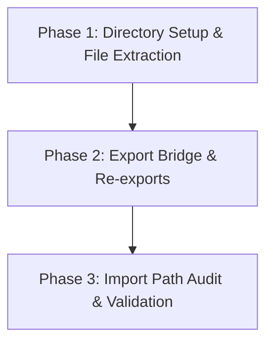

# Button Module Implementation Roadmap

> [!NOTE]
> This roadmap details the step-by-step refactoring sequence to transform `src/components/Button.js` into the project's Reference UI Module standard.

---

## 1. Current State vs. Target State

- **Current State**: Monolithic `src/components/Button.js` (339 lines) bundling `Button`, `AnimatedButton`, `ChipButton`, `IconButton`, and 2 local `StyleSheet` blocks.
- **Target State**: Standardized `src/components/Button/` directory compliant with [.docs/architecture-standards/01-reference-ui-module.md](file:///d:/Magazine/_PigmentShop/.docs/architecture-standards/01-reference-ui-module.md).

```
src/components/Button/
├── index.js
├── Button.js
├── ChipButton.js
├── IconButton.js
├── AnimatedButton.js
├── ButtonStyles.js (Existing)
└── buttonCommon.js (Existing in src/theme/)
```

---

## 2. Phased Implementation Sequence



### Phase 1: Directory & File Extraction
1. Create directory `src/components/Button/`.
2. Extract core `Button` primitive to `src/components/Button/Button.js`.
3. Extract `ChipButton` + `chipStyles` to `src/components/Button/ChipButton.js`.
4. Extract `IconButton` + `iconStyles` to `src/components/Button/IconButton.js`.
5. Extract `AnimatedButton` to `src/components/Button/AnimatedButton.js`.

### Phase 2: Export Boundary (`index.js`)
Create `src/components/Button/index.js` to re-export all primitives:
```javascript
export { default, default as Button } from './Button';
export { ChipButton } from './ChipButton';
export { IconButton } from './IconButton';
export { AnimatedButton } from './AnimatedButton';
```

### Phase 3: Backward Compatibility Bridge
Replace original `src/components/Button.js` with a 1-line re-export bridge pointing to `./Button/index` so existing consumer imports remain unbroken.

---

## 3. Validation Criteria & Reference Graduation

To graduate as the project's official **Reference UI Module**, the implementation must meet:
1. **Zero Breaking Changes**: All existing consumer components importing `Button`, `ChipButton`, or `IconButton` render without error.
2. **File Length Bound**: No single file in `src/components/Button/` exceeds 200 lines.
3. **100% Type & Prop Safety**: `hitSlop`, `activeOpacity`, animations, and theme context bindings function identically across all variants.
