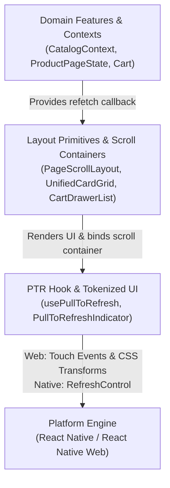
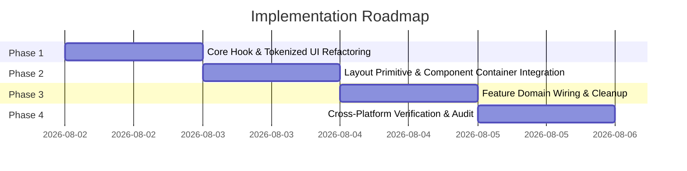

# Pull-to-Refresh Subsystem: Architecture Integration & Implementation Roadmap

> **Document Type:** Architecture Integration Specification & Implementation Roadmap  
> **Target Subsystem:** Pull-to-Refresh (`src/hooks/usePullToRefresh.js`, UI Layout Primitives, Domain Features)  
> **Status:** Final Integration Architecture (Design & Roadmap Only)

---

## 1. Subsystem Architectural Positioning

The Pull-to-Refresh (PTR) subsystem operates across three layers of the application architecture:



1. **Domain Feature Layer (`src/features/`, `src/context/`):**  
   Exposes async data-refetching functions (e.g., `refreshCatalog`, `refreshProduct`). Must **never** trigger `window.location.reload()`.
2. **Layout & Scroll Layer (`src/features/shell/`, `src/components/ui/`):**  
   Owns the scrollable container (`ScrollView`, `FlatList`, or outer scroll container) and attaches PTR handlers. Ensures single PTR registration per view.
3. **PTR Core Subsystem (`src/hooks/`, `src/components/ui/`):**  
   Provides gesture detection, scroll top validation, state management (`refreshing`, `pullDistance`), and tokenized indicator rendering.

---

## 2. Ownership Boundaries & Responsibilities

| Subsystem Component | Primary Responsibility | Prohibited Actions |
| :--- | :--- | :--- |
| `usePullToRefresh` Hook | Managing pull distance, scroll-to-top validation, touch start/move/end events, and triggering async callbacks. | Manipulating DOM nodes directly (`document.body.appendChild`), hardcoding CSS colors/styles, defaulting to `window.location.reload()`. |
| `PullToRefreshIndicator` UI | Presenting theme-tokenized pull indicator UI (icons, animations, light/dark mode adaptation). | Managing gesture touch events or calculating scroll offsets. |
| Layout Containers (`PageScrollLayout`, `UnifiedCardGrid`) | Wiring PTR hooks to scroll containers (`ScrollView` / `FlatList` / HTML scroll view) and providing native `RefreshControl` or web indicator overlay. | Registering multiple competing PTR hooks on nested child components. |
| Feature Pages (`ProductPage`, `CatalogView`, `CartDrawer`) | Passing domain refetch methods into layout containers. | Directly attaching low-level touch listeners or executing global window reloads. |

---

## 3. Public Interfaces & Integration Contracts

### 3.1 Hook Options & Return Contract (`usePullToRefresh`)

```typescript
interface PullToRefreshOptions {
  /** Optional ref to the scrollable container (FlatList / ScrollView / DOM node) */
  scrollViewRef?: React.RefObject<any>;
  /** Disables PTR gesture handling when true */
  disabled?: boolean;
}

interface PullToRefreshResult {
  /** True while an async refresh operation is pending */
  refreshing: boolean;
  /** Async trigger function to manually execute refresh */
  onRefresh: () => Promise<void>;
  /** Pull distance in pixels (0 to MAX_PULL) for web rendering */
  pullDistance: number;
}
```

### 3.2 Layout Container PTR Interface

Layout primitives accepting PTR capability (`PageScrollLayout`, `UnifiedCardGrid`, `CartDrawerList`) MUST conform to this standard prop interface:

```typescript
interface ContainerPullToRefreshProps {
  /** Async callback executed when user pulls to refresh */
  onRefresh?: () => Promise<void>;
  /** Explicit flag to disable pull-to-refresh on the layout */
  disableRefresh?: boolean;
}
```

---

## 4. Integration Points with Layouts & Scroll Containers

1. **Full-Page Layouts ([PageScrollLayout.js](file:///d:/Magazine/_PigmentShop/src/features/shell/PageScrollLayout/PageScrollLayout.js)):**  
   Wraps page content in a top-level scroll container. Integrates `usePullToRefresh` and renders `PullToRefreshIndicator` at the top of the layout on Web, or attaches `RefreshControl` on Native.
2. **List & Grid Layouts ([UnifiedCardGrid.js](file:///d:/Magazine/_PigmentShop/src/components/ui/Grid/UnifiedCardGrid.js), [ProductGrid.js](file:///d:/Magazine/_PigmentShop/src/features/catalog/ProductGrid.js)):**  
   Injects `RefreshControl` into `FlatList` for Native, and registers `usePullToRefresh` using `scrollViewRef` for Web **only when `UnifiedCardGrid` is the root scroll owner**.
3. **Modal & Overlay Containers ([CartDrawerList.js](file:///d:/Magazine/_PigmentShop/src/features/cart/CartDrawer/CartDrawerList.js)):**  
   Scoped PTR integration that isolates touch event tracking to the drawer's `ScrollView` without interfering with background page gestures.

---

## 5. Implementation Roadmap & Sequence of Phases



### Phase 1: Core Subsystem & Tokenized UI Refactoring
**Phase Complexity:** `◐ FM — 1d 2f +3r`  
*Objective: Remove raw DOM manipulation, eliminate `window.location.reload()`, and create a tokenized indicator component.*

* **Task 1.1: Create Tokenized UI Indicator Component** `◐ FM — 1d 1f +2r — Task 1.1`
  * **Target File:** `src/components/ui/Feedback/PullToRefreshIndicator.js` [NEW]
  * **Spec:** Build a React component utilizing design tokens (`src/theme/tokens.js`), supporting `isDark`, animated transitions, and rotation/opacity props based on `pullDistance`.
* **Task 1.2: Refactor `usePullToRefresh.js` Core** `◐ FM — 1d 1f +2r — Task 1.2`
  * **Target File:** [usePullToRefresh.js](file:///d:/Magazine/_PigmentShop/src/hooks/usePullToRefresh.js)
  * **Spec:** Remove direct `document.body.appendChild` and inline SVG generation. Replace default `window.location.reload()` fallback with a safe no-op or console warning. Expose clean `pullDistance` state for declarative React rendering.

#### Phase 1 Validation Checklist
- [ ] **Relevant Screens:** Any page mounting `usePullToRefresh` in mobile web viewport.
- [ ] **User Action:** Perform pull-down touch gesture from top of screen (`scrollY === 0`).
- [ ] **Expected Behavior:** 
  - `PullToRefreshIndicator` renders declaratively within React render tree (no stray `div` nodes appended to `document.body`).
  - Indicator respects theme tokens (light/dark palette) and scales opacity/rotation smoothly with `pullDistance`.
  - Releasing pull distance when no `customRefresh` callback is provided does **not** trigger `window.location.reload()`.

---

### Phase 2: Layout Primitive & Component Container Integration
**Phase Complexity:** `◐ FM — 1d 3f +3r`  
*Objective: Integrate PTR directly into layout primitives and eliminate redundant hook calls.*

* **Task 2.1: Enhance `PageScrollLayout` Primitive** `◐ FM — 1d 1f +2r — Task 2.1 [Parallel with Task 2.2]`
  * **Target File:** [PageScrollLayout.js](file:///d:/Magazine/_PigmentShop/src/features/shell/PageScrollLayout/PageScrollLayout.js)
  * **Spec:** Add `onRefresh` prop support. Wire `usePullToRefresh(onRefresh)` internally and render `PullToRefreshIndicator` at the top boundary.
* **Task 2.2: Standardize `UnifiedCardGrid` & `ProductGrid`** `◐ FM — 1d 2f +2r — Task 2.2 [Parallel with Task 2.1]`
  * **Target Files:** [UnifiedCardGrid.js](file:///d:/Magazine/_PigmentShop/src/components/ui/Grid/UnifiedCardGrid.js), [ProductGrid.js](file:///d:/Magazine/_PigmentShop/src/features/catalog/ProductGrid.js)
  * **Spec:** Ensure `usePullToRefresh` is only invoked when `onRefresh` is explicitly passed. Pass `RefreshControl` to `FlatList` on Native.

#### Phase 2 Validation Checklist
- [ ] **Relevant Screens:** Layout container test views (`PageScrollLayout` wrappers, `UnifiedCardGrid` catalog lists).
- [ ] **User Action:** 
  1. Touch and drag down from top boundary on web mobile viewport.
  2. Perform pull-to-refresh on React Native iOS/Android emulator.
- [ ] **Expected Behavior:** 
  - PTR indicator anchors cleanly to the top boundary of the layout container without overflow or clip errors.
  - Native build triggers native `<RefreshControl />` spinner without runtime errors.
  - Container-level props (`onRefresh`, `disableRefresh`) accurately control PTR enabling/disabling.

---

### Phase 3: Feature Domain Wiring & Cleanup
**Phase Complexity:** `◕ FH — 1d 5f +5r`  
*Objective: Wire domain data refetching and remove un-anchored top-level hook calls.*

* **Task 3.1: Catalog Domain Integration** `◐ FM — 1d 1f +2r — Task 3.1 [Parallel with Task 3.2, Task 3.3, Task 3.4]`
  * **Target File:** [CatalogView.js](file:///d:/Magazine/_PigmentShop/src/features/catalog/CatalogView.js)
  * **Spec:** Remove orphan `usePullToRefresh()` call from `CatalogView`. Pass `useCatalog().refreshCatalog` as `onRefresh` prop down to `UnifiedCardGrid`.
* **Task 3.2: Product Feature Integration** `◐ FM — 1d 1f +2r — Task 3.2 [Parallel with Task 3.1, Task 3.3, Task 3.4]`
  * **Target File:** [ProductPage.js](file:///d:/Magazine/_PigmentShop/src/features/product/ProductPage.js)
  * **Spec:** Delegate PTR handling to `PageScrollLayout` by passing `handleRefresh` callback as a layout prop rather than invoking `usePullToRefresh` directly inside `ProductPage`.
* **Task 3.3: Profile & Contact Layout Integration** `◐ FM — 1d 2f +2r — Task 3.3 [Parallel with Task 3.1, Task 3.2, Task 3.4]`
  * **Target Files:** [AccountLayout.js](file:///d:/Magazine/_PigmentShop/src/features/profile/components/AccountLayout.js), [ContactPage.js](file:///d:/Magazine/_PigmentShop/src/features/contact/ContactPage.js)
  * **Spec:** Remove un-anchored `usePullToRefresh()` calls or wire explicit domain refetch callbacks.
* **Task 3.4: Cart Drawer Isolation** `◐ FM — 1d 1f +2r — Task 3.4 [Parallel with Task 3.1, Task 3.2, Task 3.3]`
  * **Target File:** [CartDrawerList.js](file:///d:/Magazine/_PigmentShop/src/features/cart/CartDrawer/CartDrawerList.js)
  * **Spec:** Verify scoped PTR touch event capture on the drawer `ScrollView`.

#### Phase 3 Validation Checklist
- [ ] **Relevant Screens:** Catalog (`/catalog`), Product Detail (`/product/[id]`), Profile (`/profile`), Contact (`/contact`), and Cart Drawer overlay.
- [ ] **User Action:** 
  1. Perform PTR gesture on dynamic product route (`/product/123`).
  2. Open Cart Drawer and perform PTR pull inside drawer list.
  3. Scroll down page content, then scroll back to top and pull down.
- [ ] **Expected Behavior:** 
  - Dynamic product routes reload data via state refetch without 404 navigation errors or hard page reloads.
  - Cart drawer PTR gesture captures inside drawer scroll bounds and does **not** trigger background page PTR.
  - Scrolling down disables PTR trigger (`canPull === false`); PTR only activates when container is scrolled to top (`scrollTop === 0`).

---

### Phase 4: Cross-Platform Verification & Audit
**Phase Complexity:** `○ FL — 1d 0f +4r`  
*Objective: Validate cross-platform parity and verify complete architectural compliance.*

* **Task 4.1: Automated Cross-Platform & E2E Audit** `○ FL — 1d 0f +4r — Task 4.1`
  * **Verification:** Run mobile browser emulator and web test suites to verify smooth gesture pulling, correct top scroll locking, tokenized visual presentation, and zero page reloads.

#### Phase 4 Validation Checklist
- [ ] **Relevant Screens:** Complete application view surface (Desktop Web, Mobile Safari/Chrome, RN Mobile).
- [ ] **User Action:** Execute E2E pull-to-refresh user journeys across all main routes and dark/light theme toggles.
- [ ] **Expected Behavior:** 
  - Zero duplicate indicator instances or competing hook registrations on active screens.
  - Theme switching dynamically updates PTR indicator colors instantly.
  - 100% compliance with architectural specifications, zero unhandled errors, and clean console logs.
