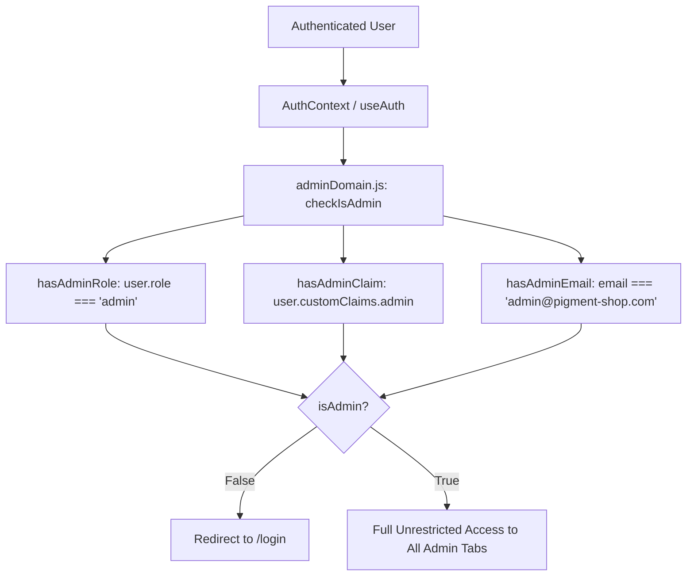

# Role-Based Access Control (RBAC) System Architecture & Technical Specification

> **Status:** Proposal / Technical Specification  
> **Target System:** Admin Panel Authorization Architecture  
> **Author:** Antigravity AI Engineering  
> **Date:** August 2026  
> **Scope:** Research and design only — **No implementation changes in this task**

---

## 1. Executive Summary

This document presents a comprehensive, scalable technical specification for introducing **Role-Based Access Control (RBAC)** with fine-grained permissions into the Pigment Shop Admin Panel.

Currently, administrative access is binary (all-or-nothing) and relies on brittle email matching and single-role checks. As the application grows, different operations personnel (e.g., store managers, inventory managers, customer support agents, marketing staff) require access restricted to their specific domains without exposing sensitive store analytics, revenue data, or customer PII.

The proposed architecture introduces a **tokenized, centralized, and reactive permission engine** that integrates seamlessly with existing React Context, Expo Router, and Firebase service layers without scattering conditional authorization logic throughout the codebase.

---

## 2. Current Architecture & Problem Analysis

### 2.1 Existing Authorization Flow

Administrative authorization is currently centralized within [`src/services/adminDomain.js`](file:///d:/Magazine/_PigmentShop/src/services/adminDomain.js) and consumed by [`app/admin/_layout.js`](file:///d:/Magazine/_PigmentShop/app/admin/_layout.js) and [`src/features/admin/AdminPanel.js`](file:///d:/Magazine/_PigmentShop/src/features/admin/AdminPanel.js).



### 2.2 Critical Limitations & Vulnerabilities

1. **Binary All-or-Nothing Model:**
   Any account passing `checkIsAdmin` gains unrestricted access to all 6 admin sections (**Analytics**, **Orders**, **Products**, **Categories**, **Banners**, **Users**).

2. **Hardcoded Email Heuristics:**
   [`src/services/adminDomain.js`](file:///d:/Magazine/_PigmentShop/src/services/adminDomain.js#L24-L26) checks if `user.email === 'admin@pigment-shop.com'` or `user.email.startsWith('admin@')`. This introduces security risks and prevents proper user attribution.

3. **No Domain or Action-Level Controls:**
   An inventory manager editing products can also view revenue charts, modify store banners, and read user notes/order history.

4. **UI-Only Enforcement:**
   Authorization checks occur predominantly at layout and component presentation layers. Underlying domain service functions (e.g., [`src/services/adminUsersService.js`](file:///d:/Magazine/_PigmentShop/src/services/adminUsersService.js)) do not inspect or enforce operational scopes.

5. **Lack of Permission Delegation UI:**
   There is no mechanism for an existing administrator to grant, inspect, or revoke administrative roles or capabilities for customer accounts.

---

## 3. Desired Behavior & Scope Requirements

The target system allows authorized administrators to manage permissions directly from the **Customers** section of the Admin Panel.

### 3.1 Customer Permission Management UI Specification

When inspecting a customer record in [`src/features/admin/Users/UserDetails.js`](file:///d:/Magazine/_PigmentShop/src/features/admin/Users/UserDetails.js):

1. **Primary Control:** A prominent **"Administrator"** toggle / checkbox control.
2. **Sub-Permission Matrix:** Enabling "Administrator" expands a granular permission checklist.
3. **Supported Permission Domains:**
   * 📊 **Analytics** (`admin:analytics`)
   * 📦 **Orders** (`admin:orders`)
   * 🎨 **Products** (`admin:products`)
   * 🏷️ **Catalog** (`admin:catalog` - Categories & Taxonomy)
   * 🖼️ **Banners** (`admin:banners`)
   * 👥 **Customers** (`admin:customers` - User view, notes, & permission management)
4. **Access Spectrum:**
   * **Full Administrator:** Every sub-permission enabled (or `SuperAdmin` role assigned).
   * **Scoped Administrator:** Selective sub-permissions enabled; Admin Panel UI conditionally mounts and renders only authorized tabs and operational controls.
   * **Standard Customer:** "Administrator" toggle disabled; standard storefront access only.

---

## 4. Proposed Architecture Design

### 4.1 System Overview & Domain Layering

The RBAC system introduces a clean separation between **Identity Storage**, **Permission Resolution Engine**, **React Context / Hook Bindings**, and **Guard Wrappers**.

```mermaid
graph TD
    subgraph Data & Storage Layer
        FB[Firebase Auth Custom Claims]
        FS[Firestore: users/{uid} & admin_roles]
    end

    subgraph Service & Domain Layer
        PS[PermissionService.js]
        AD[adminDomain.js]
    end

    subgraph React State & Guard Layer
        AC[AuthContext]
        PC[PermissionContext / usePermissions]
        RG[AdminRouteGuard / app/admin/_layout.js]
        PG[PermissionGuard Component]
    end

    subgraph Presentation Layer
        TB[AdminTabBar]
        AP[AdminPanel Tab Renderer]
        UD[UserDetails - UserPermissionEditor]
    end

    FB --> PS
    FS --> PS
    PS --> AD
    AD --> PC
    PC --> RG
    PC --> PG
    PC --> TB
    PC --> AP
    UD --> FS
```

---

## 5. Data Model & Permission Schema

### 5.1 Canonical Permission Keys

To eliminate string typos and establish a unified contract across frontend, backend, and security rules, permissions are defined as strongly typed constants.

```javascript
// src/domain/permissions/permissionTypes.js

export const ADMIN_PERMISSIONS = {
  // Domain Permissions
  ANALYTICS_READ: 'admin:analytics:read',
  ORDERS_READ: 'admin:orders:read',
  ORDERS_WRITE: 'admin:orders:write',
  PRODUCTS_READ: 'admin:products:read',
  PRODUCTS_WRITE: 'admin:products:write',
  CATALOG_READ: 'admin:catalog:read',
  CATALOG_WRITE: 'admin:catalog:write',
  BANNERS_READ: 'admin:banners:read',
  BANNERS_WRITE: 'admin:banners:write',
  CUSTOMERS_READ: 'admin:customers:read',
  CUSTOMERS_WRITE: 'admin:customers:write',
  CUSTOMERS_MANAGE_PERMISSIONS: 'admin:customers:manage_permissions',
};

export const ADMIN_ROLES = {
  SUPER_ADMIN: 'super_admin',
  CUSTOM_ADMIN: 'custom_admin',
  CUSTOMER: 'customer',
};
```

### 5.2 User Document Schema Extension

Extend the `users/{uid}` Firestore document (or dedicated `admin_permissions/{uid}` subdocument) with a structured administrative profile:

```json
{
  "uid": "usr_998124",
  "email": "manager@pigment-shop.com",
  "role": "custom_admin",
  "isAdmin": true,
  "adminPermissions": {
    "analytics": false,
    "orders": true,
    "products": true,
    "catalog": true,
    "banners": false,
    "customers": false
  },
  "permissionMetadata": {
    "grantedBy": "usr_superadmin_01",
    "grantedAt": "2026-08-02T10:00:00.000Z",
    "updatedAt": "2026-08-02T10:00:00.000Z"
  }
}
```

### 5.3 Zod Validation & Schema Integration

Following the project's existing domain schema patterns (`src/domain/schemas/`), define permission schemas:

```typescript
// src/domain/schemas/permissionSchema.ts
import { z } from 'zod';

export const AdminPermissionsSchema = z.object({
  analytics: z.boolean().default(false),
  orders: z.boolean().default(false),
  products: z.boolean().default(false),
  catalog: z.boolean().default(false),
  banners: z.boolean().default(false),
  customers: z.boolean().default(false),
});

export const UserAdminProfileSchema = z.object({
  isAdmin: z.boolean().default(false),
  role: z.enum(['super_admin', 'custom_admin', 'customer']).default('customer'),
  permissions: AdminPermissionsSchema,
  metadata: z.object({
    grantedBy: z.string().optional(),
    grantedAt: z.string().optional(),
    updatedAt: z.string().optional(),
  }).optional(),
});
```

---

## 6. Permission Flow & Resolution Engine

### 6.1 Permission Evaluation Logic (`PermissionService.js`)

Create a dedicated permission service in [`src/services/permissionService.js`](file:///d:/Magazine/_PigmentShop/src/services/permissionService.js):

```javascript
// src/services/permissionService.js

import { ADMIN_PERMISSIONS, ADMIN_ROLES } from '../domain/permissions/permissionTypes';

export function isSuperAdmin(user) {
  if (!user) return false;
  return user.role === ADMIN_ROLES.SUPER_ADMIN || user.email === 'admin@pigment-shop.com';
}

export function hasPermission(user, permissionKey) {
  if (!user) return false;
  if (isSuperAdmin(user)) return true;
  if (!user.isAdmin) return false;

  const permissions = user.adminPermissions || {};

  switch (permissionKey) {
    case ADMIN_PERMISSIONS.ANALYTICS_READ:
      return Boolean(permissions.analytics);
    case ADMIN_PERMISSIONS.ORDERS_READ:
    case ADMIN_PERMISSIONS.ORDERS_WRITE:
      return Boolean(permissions.orders);
    case ADMIN_PERMISSIONS.PRODUCTS_READ:
    case ADMIN_PERMISSIONS.PRODUCTS_WRITE:
      return Boolean(permissions.products);
    case ADMIN_PERMISSIONS.CATALOG_READ:
    case ADMIN_PERMISSIONS.CATALOG_WRITE:
      return Boolean(permissions.catalog);
    case ADMIN_PERMISSIONS.BANNERS_READ:
    case ADMIN_PERMISSIONS.BANNERS_WRITE:
      return Boolean(permissions.banners);
    case ADMIN_PERMISSIONS.CUSTOMERS_READ:
    case ADMIN_PERMISSIONS.CUSTOMERS_WRITE:
      return Boolean(permissions.customers);
    case ADMIN_PERMISSIONS.CUSTOMERS_MANAGE_PERMISSIONS:
      return Boolean(permissions.customers) && isSuperAdmin(user);
    default:
      return false;
  }
}

export function getAuthorizedAdminTabs(user) {
  if (!user || !user.isAdmin) return [];
  if (isSuperAdmin(user)) {
    return ['analytics', 'orders', 'products', 'categories', 'banners', 'users'];
  }

  const permissions = user.adminPermissions || {};
  const tabs = [];

  if (permissions.analytics) tabs.push('analytics');
  if (permissions.orders) tabs.push('orders');
  if (permissions.products) tabs.push('products');
  if (permissions.catalog) tabs.push('categories');
  if (permissions.banners) tabs.push('banners');
  if (permissions.customers) tabs.push('users');

  return tabs;
}
```

### 6.2 Hook Layer (`usePermissions.js` & `useAdminAuth.js`)

Refactor [`src/services/adminDomain.js`](file:///d:/Magazine/_PigmentShop/src/services/adminDomain.js) to consume `permissionService`:

```javascript
// Updated Hook Interface Proposal
export function usePermissions() {
  const { user } = useAuth();

  const authorizedTabs = useMemo(() => getAuthorizedAdminTabs(user), [user]);

  const can = useCallback(
    (permissionKey) => hasPermission(user, permissionKey),
    [user]
  );

  return {
    isAdmin: Boolean(user?.isAdmin),
    isSuperAdmin: isSuperAdmin(user),
    authorizedTabs,
    can,
    permissions: user?.adminPermissions || {},
  };
}
```

---

## 7. UI Integration & Component Visibility Strategy

### 7.1 Dynamic Admin Tab Bar Filtering

Update [`src/features/admin/AdminTabBar.js`](file:///d:/Magazine/_PigmentShop/src/features/admin/AdminTabBar.js) to accept authorized tabs or filter options dynamically:

```javascript
// src/features/admin/AdminTabBar.js
const ADMIN_TABS = [
  { id: 'analytics', labelKey: 'adminTabAnalytics', permission: 'admin:analytics:read' },
  { id: 'orders', labelKey: 'adminTabOrders', permission: 'admin:orders:read' },
  { id: 'products', labelKey: 'adminTabProducts', permission: 'admin:products:read' },
  { id: 'categories', labelKey: 'adminTabCategories', permission: 'admin:catalog:read' },
  { id: 'banners', labelKey: 'adminTabBanners', permission: 'admin:banners:read' },
  { id: 'users', labelKey: 'adminTabUsers', permission: 'admin:customers:read' },
];

export default function AdminTabBar({ activeTab, onSelect, isDark }) {
  const { t } = useLanguage();
  const { authorizedTabs } = usePermissions();

  const visibleTabs = useMemo(() => {
    return ADMIN_TABS.filter((tab) => authorizedTabs.includes(tab.id));
  }, [authorizedTabs]);

  // ... options generation & Toggle rendering
}
```

### 7.2 Active Tab Fallback & Auto-Selection

In [`src/features/admin/AdminPanel.js`](file:///d:/Magazine/_PigmentShop/src/features/admin/AdminPanel.js):
If the default tab (`analytics`) is unauthorized for the logged-in admin, `AdminPanel` automatically defaults `activeTab` to the first available tab in `authorizedTabs` (e.g. `orders` or `products`).

```javascript
useEffect(() => {
  if (authorizedTabs.length > 0 && !authorizedTabs.includes(activeTab)) {
    setActiveTab(authorizedTabs[0]);
  }
}, [authorizedTabs, activeTab]);
```

### 7.3 Fine-Grained Guard Component (`PermissionGuard.js`)

For intra-tab UI elements (e.g., "Create Product", "Delete Order", "Grant Admin Permissions"):

```javascript
// src/components/auth/PermissionGuard.js
import React from 'react';
import { usePermissions } from '@/hooks/usePermissions';

export function PermissionGuard({ permission, fallback = null, children }) {
  const { can } = usePermissions();
  if (!can(permission)) return fallback;
  return <>{children}</>;
}
```

---

## 8. Customer Permission Management UI Specification

### 8.1 Customer Details UI Layout (`UserDetails.js`)

In [`src/features/admin/Users/UserDetails.js`](file:///d:/Magazine/_PigmentShop/src/features/admin/Users/UserDetails.js), insert a dedicated `UserPermissionCard` component below `UserInfoCard`:

```
+-----------------------------------------------------------------------+
|  [<- Back]  Alex Customer                                            |
|                                                                       |
|  CUSTOMER PROFILE                                                     |
|  Email: alex@example.com | Phone: +1 555-0192 | City: New York       |
|                                                                       |
|  ADMINISTRATOR PERMISSIONS                                            |
|  [X] Administrator Access                                             |
|                                                                       |
|  Sub-Permissions (Active when Administrator is enabled):              |
|  +-----------------------------------------------------------------+  |
|  | [X] Analytics Dashboard                                         |  |
|  | [X] Orders Management                                           |  |
|  | [ ] Products & Inventory                                        |  |
|  | [ ] Catalog & Categories                                        |  |
|  | [ ] Banners & Marketing                                         |  |
|  | [ ] Customer Records & Permissions                              |  |
|  +-----------------------------------------------------------------+  |
|                                                                       |
|  CUSTOMER NOTES                                                       |
|  [ Text input area for admin notes... ]                               |
|                                                                       |
|  [ Save Changes ]                                                     |
+-----------------------------------------------------------------------+
```

### 8.2 Component Specification: `UserPermissionEditor.js`

```javascript
// Proposed structure: src/features/admin/Users/UserPermissionEditor.js
export default function UserPermissionEditor({
  isAdmin,
  permissions,
  onChangeAdmin,
  onChangePermission,
  disabled = false,
}) {
  const { t } = useLanguage();

  return (
    <Card style={styles.card}>
      <View style={styles.headerRow}>
        <Text variant="h4">{t('adminUserPermissionsTitle')}</Text>
        <Switch
          value={isAdmin}
          onValueChange={onChangeAdmin}
          disabled={disabled}
          testID="toggle-administrator-role"
        />
      </View>

      {isAdmin && (
        <CollapsibleContainer open={isAdmin}>
          <View style={styles.permissionGrid}>
            <CheckboxRow
              label={t('adminPermAnalytics')}
              value={permissions.analytics}
              onChange={(val) => onChangePermission('analytics', val)}
            />
            <CheckboxRow
              label={t('adminPermOrders')}
              value={permissions.orders}
              onChange={(val) => onChangePermission('orders', val)}
            />
            <CheckboxRow
              label={t('adminPermProducts')}
              value={permissions.products}
              onChange={(val) => onChangePermission('products', val)}
            />
            <CheckboxRow
              label={t('adminPermCatalog')}
              value={permissions.catalog}
              onChange={(val) => onChangePermission('catalog', val)}
            />
            <CheckboxRow
              label={t('adminPermBanners')}
              value={permissions.banners}
              onChange={(val) => onChangePermission('banners', val)}
            />
            <CheckboxRow
              label={t('adminPermCustomers')}
              value={permissions.customers}
              onChange={(val) => onChangePermission('customers', val)}
            />
          </View>
        </CollapsibleContainer>
      )}
    </Card>
  );
}
```

---

## 9. Backend & Security Architecture

### 9.1 Service Contract Authorization Wrappers

In [`src/services/adminUsersService.js`](file:///d:/Magazine/_PigmentShop/src/services/adminUsersService.js), wrap repository mutations with authorization verification:

```javascript
export async function saveUserPermissions(targetUid, { isAdmin, permissions }, executingUser) {
  if (!hasPermission(executingUser, ADMIN_PERMISSIONS.CUSTOMERS_MANAGE_PERMISSIONS)) {
    throw new Error('Unauthorized: Insufficient permissions to modify administrator roles.');
  }

  // Prevent self-demotion of Super Admin
  if (targetUid === executingUser.uid && isSuperAdmin(executingUser) && !isAdmin) {
    throw new Error('Action blocked: Super Administrator cannot revoke their own admin rights.');
  }

  return updateUserPermissionsRepo(targetUid, {
    isAdmin,
    role: isAdmin ? ADMIN_ROLES.CUSTOM_ADMIN : ADMIN_ROLES.CUSTOMER,
    adminPermissions: permissions,
    permissionMetadata: {
      grantedBy: executingUser.uid,
      updatedAt: new Date().toISOString(),
    },
  });
}
```

### 9.2 Firestore Security Rules

To guarantee backend-level security independent of client code:

```javascript
rules_version = '2';
service cloud.firestore {
  match /databases/{database}/documents {
    
    function isSuperAdmin() {
      return request.auth != null && 
        (request.auth.token.role == 'super_admin' || request.auth.token.email == 'admin@pigment-shop.com');
    }
    
    function hasAdminPerm(permission) {
      return request.auth != null && 
        request.auth.token.isAdmin == true && 
        request.auth.token.permissions[permission] == true;
    }

    // Customer permissions modification restricted to SuperAdmin
    match /users/{userId} {
      allow read: if request.auth != null;
      allow update: if isSuperAdmin() || 
        (request.auth.uid == userId && !request.resource.data.diff(resource.data).affectedKeys().hasAny(['isAdmin', 'role', 'adminPermissions']));
    }

    // Orders Collection
    match /orders/{orderId} {
      allow read, write: if isSuperAdmin() || hasAdminPerm('orders');
    }

    // Products & Catalog Collections
    match /products/{productId} {
      allow read: if true;
      allow write: if isSuperAdmin() || hasAdminPerm('products');
    }
  }
}
```

---

## 10. Architectural Trade-Off Analysis

| Approach | Implementation Complexity | Real-Time Sync | Security Level | Latency Overhead | Recommendation |
| :--- | :--- | :--- | :--- | :--- | :--- |
| **Approach 1: Custom Claims Only** | Medium | Low (Requires token refresh or relogin) | High | Minimal | Not recommended alone (delayed UI update) |
| **Approach 2: Firestore Document Flags Only** | Low | High (Reactive context listener) | Medium (Client can inspect Firestore doc) | Minor DB read cost | Good for prototype, lacks JWT security rule context |
| **Approach 3: Hybrid (Firestore Document + Custom Claims Sync)** | Medium-High | High | Maximum | Optimal | **RECOMMENDED** |

### Justification for Hybrid Approach:
1. **Frontend Reactivity:** Storing permission flags in `users/{uid}` allows `AuthContext` to update permissions instantly without requiring users to log out and log back in.
2. **Backend Protection:** Syncing top-level flags to Firebase Custom Claims provides lightning-fast Security Rule evaluations on Firebase backend operations.
3. **Consistency:** Aligns directly with existing project patterns (`withServiceContract`, Zod validation, tokenized design tokens).

---

## 11. Migration Strategy & Backward Compatibility

To transition smoothly from the current single-admin setup to granular RBAC:

1. **Bootstrap Migration Script / Seed:**
   When the migration script executes:
   - Identify `admin@pigment-shop.com` (and existing accounts matching `checkIsAdmin`).
   - Assign `role: 'super_admin'` and `isAdmin: true` with all sub-permissions set to `true`.
2. **Fallback Compatibility in `checkIsAdmin`:**
   Maintain backward compatibility during rollout:
   ```javascript
   function checkIsAdmin(user) {
     if (!user) return false;
     if (user.role === 'super_admin' || user.email === 'admin@pigment-shop.com') return true;
     return Boolean(user.isAdmin);
   }
   ```
3. **Zero Interruption for Storefront Users:**
   Storefront shoppers without `isAdmin` continue operating with zero overhead or context payload changes.

---

## 12. Implementation Task Breakdown

The following tasks outline the execution roadmap for future implementation work:

### Phase 1: Core Domain & Data Layer
- [ ] **Task 1.1:** Create `src/domain/permissions/permissionTypes.js` defining canonical permission strings and roles.
- [ ] **Task 1.2:** Add Zod schema definitions (`AdminPermissionsSchema`, `UserAdminProfileSchema`) in `src/domain/schemas/`.
- [ ] **Task 1.3:** Implement `src/services/permissionService.js` containing `hasPermission` and `getAuthorizedAdminTabs` evaluation functions.
- [ ] **Task 1.4:** Update `src/services/repositories/usersRepository.js` to support reading and writing `adminPermissions` and `isAdmin` flags on user records.

### Phase 2: React State & Navigation Integration
- [ ] **Task 2.1:** Create `usePermissions` hook in `src/hooks/usePermissions.js` and integrate permission resolution into `AuthContext`.
- [ ] **Task 2.2:** Update `app/admin/_layout.js` to inspect permissions and handle unauthorized route attempts.
- [ ] **Task 2.3:** Refactor `src/features/admin/AdminTabBar.js` to filter visible tabs dynamically based on `authorizedTabs`.
- [ ] **Task 2.4:** Update `src/features/admin/AdminPanel.js` to fallback to the first available authorized tab when mounting or switching accounts.

### Phase 3: Customer Management UI & Admin Controls
- [ ] **Task 3.1:** Create `src/features/admin/Users/UserPermissionEditor.js` component with primary Administrator toggle and sub-permission checkboxes.
- [ ] **Task 3.2:** Integrate `UserPermissionEditor` into `src/features/admin/Users/UserDetails.js`.
- [ ] **Task 3.3:** Add `saveUserPermissions` function in `src/services/adminUsersService.js` with self-demotion checks and audit logging.
- [ ] **Task 3.4:** Add mock data support for permissions in `src/services/mocks/mockUsersRepository.js`.

### Phase 4: Backend Security & Verification
- [ ] **Task 4.1:** Write and deploy updated Firestore Security Rules enforcing permissions on Firestore mutations.
- [ ] **Task 4.2:** Create unit tests in `__tests__/permissions/permissionService.test.js` validating authorization scenarios.
- [ ] **Task 4.3:** Perform manual end-to-end verification across SuperAdmin, Scoped Admin, and Customer user workflows.
