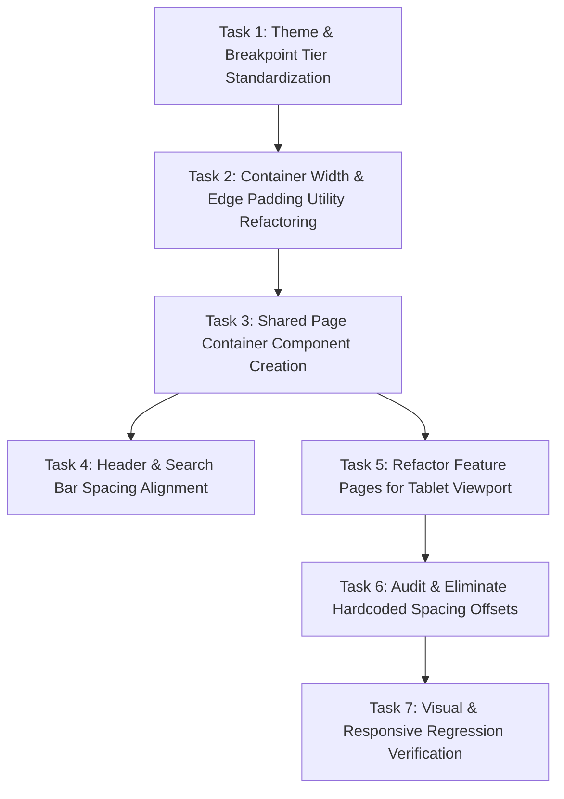

# Tablet Layout Consistency Audit & Specification

## Objective

This document provides a comprehensive UI audit of the application in the **tablet breakpoint** (screen width between mobile `768px` and desktop `1024px`, specifically `768px <= width < 1024px`). It identifies inconsistencies in horizontal spacing, layout tokens, container widths, and content alignment across user-facing storefront pages compared to the Admin Panel, analyzes root causes, and defines a technical specification and task breakdown for standardizing the tablet layout.

> [!IMPORTANT]
> **Investigation Only**: No code modifications have been implemented during this audit.

---

## 1. System Overview & Token Architecture

### 1.1 Layout System & Tokens

The application defines layout tokens in [src/theme/layout.js](file:///d:/Magazine/_PigmentShop/src/theme/layout.js):

* **Breakpoints**:
  * `sm`: `640px`
  * `mobile`: `768px`
  * `desktop`: `1024px`
* **Max Content Width**: `1330px`
* **Spacing Scale**: `none` (0), `xxxs` (2), `xxs` (4), `xs` (6), `sm` (8), `md` (12), `lg` (16), `xl` (24), `xxl` (32)
* **Grid Tokens** ([src/utils/layoutUtils.js](file:///d:/Magazine/_PigmentShop/src/utils/layoutUtils.js)):
  * `GRID_COLS`: `desktop: 5`, `tablet: 3`, `mobile: 2`
  * `GRID_COLS_FILTERED`: `desktop: 4`, `tablet: 3`, `mobile: 2`
  * `GRID_GAP`: `desktop: 16` (`lg`), `tablet: 12` (`md`), `mobile: 8` (`sm`)

### 1.2 Identified Core System Weakness

1. **Binary Breakpoint Logic**:
   Across hooks (`useAppShell`, `useCatalogRootData`, `useCart`, `useProfile`) and pages, responsive design relies on binary flags:
   * `const isWide = windowWidth >= 768;`
   * `const isMobile = windowWidth < 768;`
   Because `isWide` is `true` for both tablet (`768px–1023px`) and desktop (`>=1024px`), storefront pages prematurely switch into desktop multi-column layouts at `768px`.

2. **Container Width Edge Padding Drop (`getContentGridWidth`)**:
   In [src/utils/layoutUtils.js](file:///d:/Magazine/_PigmentShop/src/utils/layoutUtils.js#L83-L87):
   ```javascript
   export function getContentGridWidth(windowWidth, depth = 0, hasFilterSidebar = false) {
     const isMobile = windowWidth < layoutTokens.breakpoints.mobile; // < 768
     const edgePadding = isMobile ? layoutTokens.spacing.lg * 2 : 0; // 32px on mobile, 0px on wide!
     return Math.min(windowWidth, layoutTokens.maxContentWidth) - edgePadding;
   }
   ```
   * When `windowWidth < 768` (Mobile), `edgePadding` = `32px` (16px left + 16px right).
   * When `windowWidth >= 768` (Tablet & Desktop), `edgePadding` drops to `0px`!
   * Consequently, on tablet screens (`768px` to `1023px`), `getContentGridWidth` returns `windowWidth` (100% viewport width), causing grid items and headers to touch screen edges unless individual components add ad-hoc padding.

---

## 2. Page-by-Page Audit

### 2.1 App Shell, Header & Search Bar

| Element | Tablet Spacing / Alignment | Token Used | Status & Issues |
| :--- | :--- | :--- | :--- |
| **AppHeader** ([AppHeaderStyles.js](file:///d:/Magazine/_PigmentShop/src/features/shell/AppHeader/AppHeaderStyles.js)) | `paddingHorizontal: 12px` | `layout.spacing.md` | ⚠️ Inconsistent with search header & page margins |
| **StoreSearchHeader** ([StoreSearchHeader.js](file:///d:/Magazine/_PigmentShop/src/features/shell/StoreSearchHeader.js)) | `paddingHorizontal: 16px` | `layout.spacing.lg` | ⚠️ Disaligned from `AppHeader` (12px vs 16px) |
| **NavMenu Drawer** ([NavMenuStyles.js](file:///d:/Magazine/_PigmentShop/src/features/shell/NavMenu/NavMenuStyles.js)) | `paddingHorizontal: 16px` | `layout.spacing.lg` | ✅ Standard token |

### 2.2 Home Screen (`/`)

* **Components**: `HeroCarousel`, `FeaturedSections`, `DiscountsSection` via [CatalogView.js](file:///d:/Magazine/_PigmentShop/src/features/catalog/CatalogView.js)
* **Hero Carousel** ([carouselStyles.js](file:///d:/Magazine/_PigmentShop/src/features/home/components/HeroCarousel/carouselStyles.js)):
  * At `768px`, `isWide` is `true`. Breakout negative margins are removed, and carousel snaps to a boxed card with `borderRadius: 24` (`layout.radii.xl`) and fixed height `360px` (`heroRightWide`).
  * On narrow tablets (`768px–850px`), the height-to-width ratio creates vertical stretching of hero images.
* **Featured & Category Sections**:
  * Title row uses `paddingHorizontal: 16px` (`layout.spacing.lg`).
  * Cards use 3 columns in tablet mode (`GRID_COLS.tablet = 3`) with `gap: 12px` (`layout.spacing.md`), but container edge padding is inconsistent with header.

### 2.3 Catalog & All Products (`/catalog`)

* **Components**: `CatalogView`, `CatalogHeader`, `CatalogFilterSidebar`, `ProductGrid`
* **Grid Behavior**:
  * Outer grid width is set to `getContentGridWidth(windowWidth)` = `windowWidth` (0px edge margin).
  * Card grid renders 3 columns (`GRID_COLS.tablet = 3`).
* **Filter Sidebar** ([CatalogFilterSidebarStyles.js](file:///d:/Magazine/_PigmentShop/src/features/catalog/CatalogFilterSidebarStyles.js)):
  * In tablet mode, filter sidebar compresses main product grid into remaining `~500px`, causing 3 product columns to shrink below minimum readable width (~150px per card).

### 2.4 Product Details (`/product/[id]`)

* **Components**: `ProductPage`, `ProductImagePanel`, `ProductInfoPanel`, `ProductReviews`
* **Layout Issue**:
  * [ProductPageStyles.js](file:///d:/Magazine/_PigmentShop/src/features/product/ProductPageStyles.js#L19-L28):
    ```javascript
    wideRow: { flexDirection: 'row', padding: layout.spacing.xxl, gap: layout.spacing.xxl }, // 32px padding & gap
    narrowStack: { paddingHorizontal: layout.spacing.lg, paddingTop: layout.spacing.sm },
    ```
  * At `768px`, `isWide` triggers `wideRow` (2 equal columns: Image + Product Info side by side).
  * **Result**: On a `768px` screen, total outer padding (64px) + column gap (32px) consumes `96px` (12.5% of viewport width). Each column receives only `336px` width. Combined with `carouselContainerWide` height of `500px`, the product image becomes narrow and excessively tall, while product details and action buttons become cramped vertically.

### 2.5 Contacts (`/contact`)

* **Components**: `ContactPage`, `ContactInfoSection`, `ContactFormSection`, `ContactAuxiliarySection`
* **Layout Issue**:
  * [ContactPage.js](file:///d:/Magazine/_PigmentShop/src/features/contact/ContactPage.js#L48): `isMultiCol = windowWidth >= 768;`
  * At `768px`, page switches to a **3-column side-by-side grid** (`colLeft: flex 1`, `colCenter: flex 1.5`, `colRight: flex 1`) with `gap: 24px` (`layout.spacing.xl`).
  * **Result**: On a `768px` tablet screen, `colLeft` (Contact Info) receives only `~180px` width, `colCenter` (Form) receives `~270px` width, and `colRight` (Auxiliary Map) receives `~180px` width. Form fields and labels wrap awkwardly and break visual hierarchy.

### 2.6 Profile & Account (`/profile`)

* **Components**: `ProfilePage`, `AccountLayout`, `ProfileSidebar`, `ProfileFormCard`
* **Layout Issue**:
  * [AccountLayout.js](file:///d:/Magazine/_PigmentShop/src/features/profile/components/AccountLayout.js#L39): `flexDirection: isWide ? 'row' : 'column'`
  * `ProfileSidebar` has a fixed width of `260px` ([AccountLayoutStyles.js](file:///d:/Magazine/_PigmentShop/src/features/profile/components/AccountLayoutStyles.js#L26)).
  * On a `768px` screen, sidebar (260px) + gap (16px) + outer padding (32px) leaves only `460px` for the main form. While usable, the sidebar occupies >35% of horizontal space.

### 2.7 Shopping Cart (`/cart`)

* **Components**: `CartView`, `CartViewContent`, `CartItem`, `CartSummary`
* **Layout Issue**:
  * At `768px`, `isWide` renders `renderWideLayout` ([CartViewContent.js](file:///d:/Magazine/_PigmentShop/src/features/cart/CartViewContent.js#L33-L44)): Left Column (`flex 1.8`), Right Column Summary (`flex 1.2`) with `gap: 24px`.
  * Item title, quantity buttons, and price columns become cramped in the left column on narrow tablets (`768px–880px`).

### 2.8 Admin Panel (`/admin`) — Comparison Benchmark

* **Components**: `AdminPanel`, `AdminTabBar`, Data Tables & Managers
* **Layout Behavior**:
  * [AdminPanelStyles.js](file:///d:/Magazine/_PigmentShop/src/features/admin/AdminPanelStyles.js): Header and TabBar use consistent `paddingHorizontal: 24px` (`layout.spacing.xl`) across both tablet and desktop viewports.
  * **Data Alignment**: Tables use horizontal scrolling or responsive column hiding rather than wrapping elements into cramped vertical stacks.
  * **Consistency**: Spacing between header, tab controls, and content containers is unified via `layout.spacing.xl` and `layout.spacing.md`.

---

## 3. Hardcoded Spacing & Non-Compliant Components

The audit identified multiple components using hardcoded pixel values or non-standard arithmetic expressions for spacing instead of layout tokens:

| File | Line | Expression / Hardcoded Value | Correct Token Equivalent |
| :--- | :--- | :--- | :--- |
| `AppHeaderStyles.js` | 156, 184 | `paddingHorizontal: layout.spacing.xs + 4` (10px) | `layout.spacing.md` (12px) or new `sm_md` token |
| `AppHeaderStyles.js` | 174 | `gap: -8` | Dedicated overlap token or clean margin |
| `ProductPageStyles.js` | 54 | `marginBottom: layout.spacing.sm + 2` (10px) | `layout.spacing.md` (12px) |
| `ProductPageStyles.js` | 114 | `paddingHorizontal: layout.spacing.lg + 4` (20px) | `layout.spacing.xl` (24px) |
| `ProductPageStyles.js` | 266 | `padding: layout.spacing.xxl + layout.spacing.sm` (40px) | Standard token or `layout.spacing.xxl` |
| `OrderRows.js` | 112, 134 | `paddingHorizontal: 10`, `paddingHorizontal: 8` | `layout.spacing.sm` (8px), `layout.spacing.md` (12px) |
| `CartViewStyles.js` | 165 | `height: 40` | `layout.spacing.xxl + layout.spacing.sm` or explicit button height token |
| `commonStyles.js` | 60 | `height: layout.spacing.xxl + layout.spacing.sm` | Unified layout spacer token |

---

## 4. Probable Root Causes

1. **Lack of Explicit Tablet Breakpoint Tier**:
   `src/theme/layout.js` defines `sm` (640), `mobile` (768), and `desktop` (1024), but lacks a dedicated `tablet` range. Consequently, developers treated `windowWidth >= 768` as "wide desktop", applying desktop multi-column structures to tablet screens.

2. **Inconsistent Container Edge Padding**:
   `getContentGridWidth` zeroes out `edgePadding` for `width >= 768`, assuming max-width centering would handle edges. On screens between `768px` and `1330px`, this removes outer gutter margins entirely unless pages manually re-add padding.

3. **Absence of Unified `<PageContainer>` Wrapper**:
   Storefront pages independently manage their container bounds, scroll behavior, edge padding, and inner width calculations, leading to divergence between Home, Catalog, Product Details, Contacts, Profile, and Cart.

---

## 5. Standardization Strategy & Recommendations

### 5.1 Introduce Explicit Tablet Breakpoint Range
Update `src/theme/layout.js` and `src/utils/layoutUtils.js` to include explicit device tiers:
* `mobile`: `width < 768px`
* `tablet`: `768px <= width < 1024px`
* `desktop`: `width >= 1024px`

### 5.2 Standardize Tablet Edge Padding
Update `getContentGridWidth` to enforce standard outer gutters across all device tiers:
* `mobile`: `16px` left/right gutter (`layout.spacing.lg`)
* `tablet`: `24px` left/right gutter (`layout.spacing.xl`)
* `desktop`: Centered `1330px` max-width with `24px` or `32px` gutter fallback

### 5.3 Adopt Responsive Layout Rules for Tablet
* **Product Details**:
  * Tablet (`768px–1023px`): Maintain 2-column layout but reduce image panel max-height (`380px` instead of `500px`) and lower padding from `32px` to `20px/24px`.
* **Contact Page**:
  * Tablet (`768px–1023px`): Switch from 3 columns to **2 columns** (Left: Contact Info + Auxiliary Map; Right: Contact Form) or single-column stack.
* **Profile / Account**:
  * Tablet (`768px–1023px`): Compact sidebar (`200px` width) or horizontal tab bar header.
* **Cart Page**:
  * Tablet (`768px–1023px`): Adjust flex ratio to `2:1` or collapse order summary below items for widths `< 880px`.

### 5.4 Centralized `<StorefrontPageContainer>` Wrapper
Create a unified page wrapper component (`src/components/ui/Layout/StorefrontPageContainer.js`) that automatically applies standard horizontal edge padding, max content width constraints, and dark/light background tokens to eliminate per-page style drift.

---

## 6. Implementation Task Breakdown

The following task breakdown specifies the technical steps required for implementation in a future phase:



### Phase 1: Core System & Tokens

* [x] **Task 1: Theme & Breakpoint Tier Standardization** `◐ FM — 1d 2f +2r`
  * File: [src/theme/layout.js](file:///d:/Magazine/_PigmentShop/src/theme/layout.js)
  * Add explicit `tablet: 768`, `tabletMax: 1023` breakpoint tokens.
  * Update `getDeviceTier(windowWidth)` in [src/utils/layoutUtils.js](file:///d:/Magazine/_PigmentShop/src/utils/layoutUtils.js) to return `'mobile' | 'tablet' | 'desktop'`.

* [x] **Task 2: Container Width & Edge Padding Utility Refactoring** `◐ FM — 1d 1f +1r`
  * File: [src/utils/layoutUtils.js](file:///d:/Magazine/_PigmentShop/src/utils/layoutUtils.js)
  * Update `getContentGridWidth` to apply `24px` (`layout.spacing.xl`) edge padding for tablet tier (`768px <= width < 1024px`).

* [x] **Task 3: Shared Page Container Component Creation** `◐ FM — 1d 1f +2r`
  * File: `src/components/ui/Layout/StorefrontPageContainer.js`
  * Create a standard layout wrapper component encapsulating `maxWidth: 1330`, responsive horizontal padding (`mobile: 16px`, `tablet: 24px`, `desktop: 24px`), and safe-area inset handling.

### Phase 2: Shell & Navigation Alignment

* [x] **Task 4: Header & Search Bar Spacing Alignment** `◐ FM — 1d 3f +3r`
  * Files: [AppHeaderStyles.js](file:///d:/Magazine/_PigmentShop/src/features/shell/AppHeader/AppHeaderStyles.js), [StoreSearchHeader.js](file:///d:/Magazine/_PigmentShop/src/features/shell/StoreSearchHeader.js), [appStyles.js](file:///d:/Magazine/_PigmentShop/src/theme/appStyles.js)
  * Standardize `AppHeader` inner row padding (`16px` mobile, `24px` tablet/desktop).
  * Align `StoreSearchHeader` `searchInner` padding to match `AppHeader` exactly.

### Phase 3: Storefront Feature Pages Refactoring

* [x] **Task 5: Refactor Feature Pages for Tablet Viewport** `◕ FH — 3d 9f +11r`
  * **Subtask 5.1: Home & Catalog View** `◐ FM — 1d 2f +3r`
    * Files: [CatalogView.js](file:///d:/Magazine/_PigmentShop/src/features/catalog/CatalogView.js), [carouselStyles.js](file:///d:/Magazine/_PigmentShop/src/features/home/components/HeroCarousel/carouselStyles.js)
    * Adjust `HeroCarousel` container height on tablet (`768px–1023px`) to `280px–320px`.
  * **Subtask 5.2: Product Details Page** `◐ FM — 1d 2f +2r`
    * Files: [ProductPage.js](file:///d:/Magazine/_PigmentShop/src/features/product/ProductPage.js), [ProductPageStyles.js](file:///d:/Magazine/_PigmentShop/src/features/product/ProductPageStyles.js)
    * Reduce `wideRow` padding from `32px` to `24px` on tablet; adjust image height in tablet breakpoint to prevent vertical stretching.
  * **Subtask 5.3: Contacts Page Layout** `◐ FM — 1d 1f +2r`
    * Files: [ContactPage.js](file:///d:/Magazine/_PigmentShop/src/features/contact/ContactPage.js)
    * Change multi-column trigger to `width >= 1024px` (desktop), keeping 2-column or stacked layout on tablet (`768px–1023px`).
  * **Subtask 5.4: Profile / Account Layout** `◐ FM — 1d 2f +2r`
    * Files: [AccountLayout.js](file:///d:/Magazine/_PigmentShop/src/features/profile/components/AccountLayout.js), [AccountLayoutStyles.js](file:///d:/Magazine/_PigmentShop/src/features/profile/components/AccountLayoutStyles.js)
    * Set sidebar width to `200px` or responsive flex ratio (`1:2.5`) on tablet breakpoint.
  * **Subtask 5.5: Cart View** `◐ FM — 1d 2f +2r`
    * Files: [CartViewContent.js](file:///d:/Magazine/_PigmentShop/src/features/cart/CartViewContent.js), [CartViewStyles.js](file:///d:/Magazine/_PigmentShop/src/features/cart/CartViewStyles.js)
    * Set two-column layout threshold to `width >= 880px` or adjust flex proportions to `2:1` on tablet.

### Phase 4: Code Hygiene & Verification

* [ ] **Task 6: Audit & Eliminate Hardcoded Spacing Offsets** `◕ FH — 2d 6f +6r`
  * Replace expressions like `layout.spacing.xs + 4`, `layout.spacing.sm + 2`, `layout.spacing.lg + 4`, and raw numbers (`10`, `8`, `40`) with standard theme tokens across all updated files.

* [ ] **Task 7: Visual & Responsive Regression Verification** `○ FL — 1d 0f +5r`
  * Validate storefront pages in Playwright/browser at key viewport breakpoints: `375px` (Mobile), `768px` (Tablet Small), `834px` (iPad Portrait), `1024px` (Tablet Landscape / Desktop Small), and `1440px` (Desktop Wide).
  * Ensure horizontal alignment between Header, Search Bar, Main Content Grid, and Footer across all screens.
