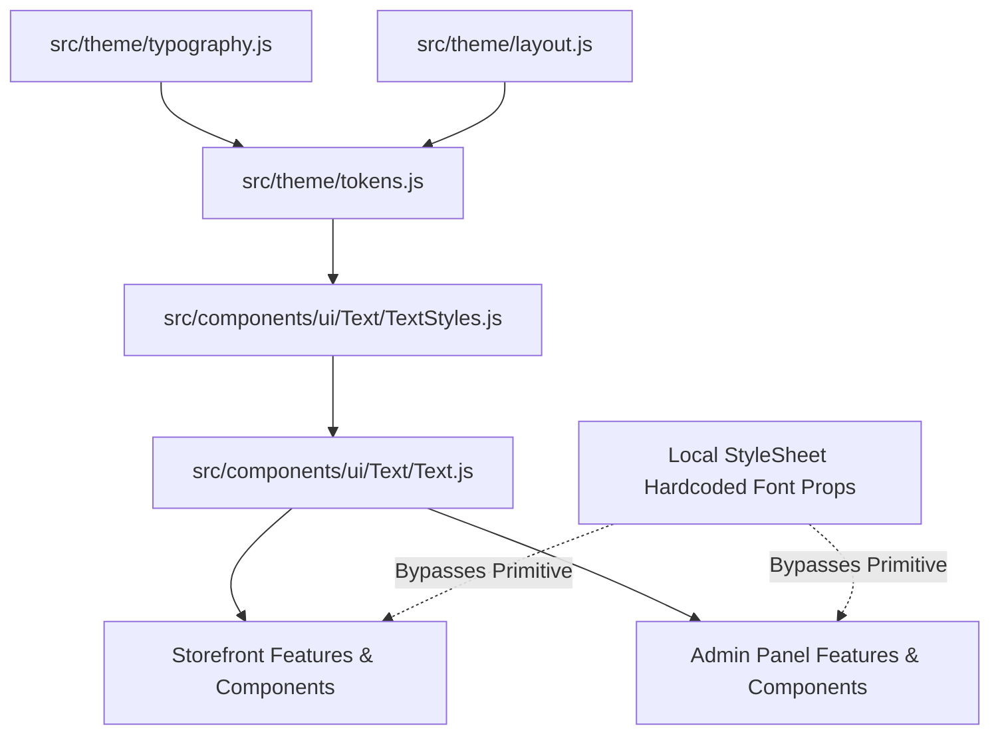
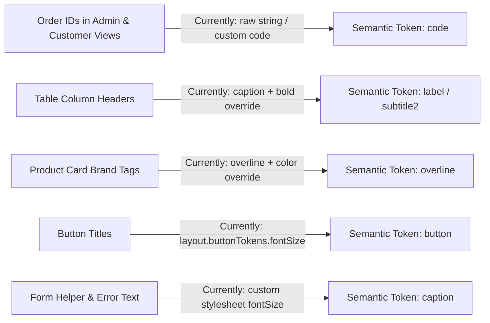
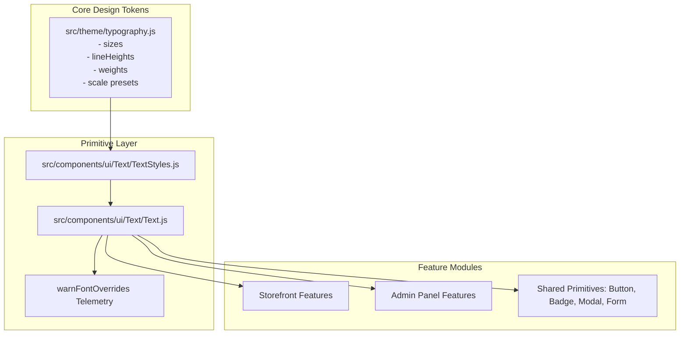

# Project-Wide Typography Tokenization & Standardization Technical Specification

> **Status:** Draft / Technical Specification  
> **Target System:** Application-Wide Typography Architecture (Storefront & Admin Panel)  
> **Author:** Antigravity AI Engineering  
> **Date:** August 2026  
> **Scope:** Audit, Semantic Classification, and Standardization Specification — **No code implementation in this task**

---

## Executive Summary

This document presents a comprehensive audit, semantic classification framework, and architectural standardization plan for the application's typography system across both the **Storefront** and **Admin Panel**.

Currently, the application contains a foundational typography token system in [`src/theme/typography.js`](file:///d:/Magazine/_PigmentShop/src/theme/typography.js) and a primitive UI text component in [`src/components/ui/Text/Text.js`](file:///d:/Magazine/_PigmentShop/src/components/ui/Text/Text.js). However, typography enforcement across feature modules remains fragmented:
- Component styles frequently inject hardcoded `fontSize`, `fontWeight`, `lineHeight`, and `fontFamily` values into local stylesheet definitions.
- Auxiliary tokens in [`src/theme/layout.js`](file:///d:/Magazine/_PigmentShop/src/theme/layout.js) (such as `buttonTokens` and `badgeTokens`) redefine inline font metrics outside of the core typography scales.
- Multiple components pass custom inline style objects to `<Text>`, causing runtime override warnings (`warnFontOverrides`) and bypassing design token governance.

The objective of this initiative is to transition the application to a **100% token-driven typography system** where every visible string utilizes a semantic typography token, eliminating local style overrides and ensuring centralized design system updates propagate instantly across all platforms (Web and Native).

---

## Phase 1 — Typography Tokenization Audit

### 1.1 Existing Typography Architecture Overview

The current design system defines typography tokens across three primary layers:

1. **Core Token Definitions ([`src/theme/typography.js`](file:///d:/Magazine/_PigmentShop/src/theme/typography.js)):**
   - Font Families: `primary` (System sans-serif) and `mono` (Courier / Consolas / UI-Monospace).
   - Discrete Font Sizes: `xxs` (10), `xs` (12), `sm` (14), `md` (16), `lg` (20), `xl` (24), `xxl` (28), `display` (36), `h1` (28), `h2` (24), `h3` (20), `body1` (16), `body2` (14), `caption` (12), `label` (12), `code` (13).
   - Discrete Line Heights: Matching 14px to 42px scale.
   - Font Weights: `regular` ('400'), `medium` ('500'), `semibold` ('600'), `bold` ('700').
   - Letter Spacing: `tight` (-0.5), `normal` (0), `wide` (0.5), `widest` (1).
   - Scale Preset Map: Pre-configured combinations for `display`, `h1`, `h2`, `h3`, `body1`, `body2`, `caption`, `label`, `code`.

2. **Primitive Component Layer ([`src/components/ui/Text/Text.js`](file:///d:/Magazine/_PigmentShop/src/components/ui/Text/Text.js)):**
   - Wraps React Native's `<RNText>` component.
   - Maps variants (`display`, `h1`, `h2`, `h3`, `h4`, `subtitle1`, `subtitle2`, `body1`, `body2`, `caption`, `label`, `overline`, `code`) via [`src/components/ui/Text/TextStyles.js`](file:///d:/Magazine/_PigmentShop/src/components/ui/Text/TextStyles.js).
   - Includes developer warning telemetry (`warnFontOverrides`) that detects and logs custom `fontSize`, `lineHeight`, `fontWeight`, or `fontFamily` props passed via `style`.

3. **Auxiliary Token Leaks ([`src/theme/layout.js`](file:///d:/Magazine/_PigmentShop/src/theme/layout.js)):**
   - `buttonTokens.sizes.sm`, `md`, `lg` specify hardcoded `fontSize: 12`, `fontSize: 13`, and `fontSize: 14` instead of deriving them from `typography.sizes`.
   - `badgeTokens.fontSizes.md` specifies hardcoded `fontSize: 11` (which does not exist in `typography.sizes`).

---

### 1.2 Comprehensive Category Audit & Hardcoded Style Findings

An exhaustive scan across all application domains reveals several patterns of non-tokenized text, duplicate definitions, and style bypasses:

#### A. Admin Panel (`src/features/admin/`)
* **Analytics Calendar & Charts ([`src/features/admin/Analytics/DateRangeCalendarStyles.js`](file:///d:/Magazine/_PigmentShop/src/features/admin/Analytics/DateRangeCalendarStyles.js), [`CalendarDayCell.js`](file:///d:/Magazine/_PigmentShop/src/features/admin/Analytics/CalendarDayCell.js)):**
  - Hardcoded day cell labels (`fontSize: 11`, `fontSize: 12`, `fontWeight: '600'`) defined directly inside React Native `StyleSheet.create` blocks instead of referencing semantic typography tokens.
  - Revenue chart legends and axis labels using inline `fontSize: 10` and `fontWeight: '500'`.
* **Admin Data Tables & Action Toolbars:**
  - Table headers in order and inventory tables mixing `variant="code"` and `variant="caption"` with inline `fontWeight: '700'` and custom line heights.
  - Status badges in customer list tables bypassing tokenized colors and using hardcoded small text styles.

#### B. Storefront Navigation & Header (`src/features/shell/`)
* **App Header & Navigation Drawer ([`src/features/shell/AppHeader/AppHeaderStyles.js`](file:///d:/Magazine/_PigmentShop/src/features/shell/AppHeader/AppHeaderStyles.js), [`NavMenuHeader.js`](file:///d:/Magazine/_PigmentShop/src/features/shell/NavMenu/NavMenuHeader.js)):**
  - Brand logo text in header applying custom `fontSize: 22` and letter spacing overrides.
  - Navigation links mixing `body2` with inline weight overrides (`weight="600"`, `weight="700"`) across mobile navigation items.

#### C. Product Details & Catalog (`src/features/product/`, `src/features/catalog/`)
* **Product Info Subcomponents ([`src/features/product/ProductInfoSubcomponents.js`](file:///d:/Magazine/_PigmentShop/src/features/product/ProductInfoSubcomponents.js)):**
  - Price text using `variant="h2"` with explicit inline `weight="700"`, while original crossed-out price applies custom opacity and font size modifications via `style={[styles.originalPriceText]}`.
  - Quantity selector value text applying `variant="body2"` with explicit `weight="bold"`.
* **Product Review Cards ([`src/features/product/ProductReviewSubcomponents.js`](file:///d:/Magazine/_PigmentShop/src/features/product/ProductReviewSubcomponents.js)):**
  - Reviewer names using raw `<Text style={styles.author}>` without specifying a `variant` prop, falling back to default `body1` with stylesheet-level font overrides.

#### D. Orders & Checkout (`src/features/orders/`, `src/features/checkout/`)
* **Order List & Details ([`src/features/orders/OrderRows.js`](file:///d:/Magazine/_PigmentShop/src/features/orders/OrderRows.js), [`OrderDetailsCard.js`](file:///d:/Magazine/_PigmentShop/src/features/orders/OrderDetailsCard.js)):**
  - Table column headers in order breakdown tables using `variant="caption"` with inline `{ textAlign: 'right' }` and `weight="bold"`.
  - Order numbers toggling between `variant="code"` for Admin views and `variant="subtitle1"` for Customer views without unified semantic tokens.

#### E. Shared UI Primitives & Input Controls (`src/components/ui/`)
* **Text Field Input Styles ([`src/components/ui/TextField/TextFieldStyles.js`](file:///d:/Magazine/_PigmentShop/src/components/ui/TextField/TextFieldStyles.js)):**
  - Inputs enforce web-specific Safari font scaling guards (`fontSize: isWeb ? Math.max(16, typography.sizes.sm) : typography.sizes.sm`).
  - Field helper text and error message strings apply conditional font sizes ad-hoc inside `TextFieldStyles.js`.
* **Chip Buttons ([`src/components/ui/Button/ChipButton.js`](file:///d:/Magazine/_PigmentShop/src/components/ui/Button/ChipButton.js)):**
  - Button text relies on `buttonTokens.sizes` which injects numeric `fontSize` values (12, 13, 14) into text components rather than variant tokens.

---

## Phase 2 — Typography Classification

### 2.1 Semantic Role Mapping Framework

To achieve visual consistency and maintainability, every text element must be mapped to a dedicated **Semantic Typography Token**. Components must never dictate explicit pixel font sizes or font weights directly.

| Semantic Token | Target Role / UI Context | Size (px) | Line Height (px) | Weight | Letter Spacing |
| :--- | :--- | :---: | :---: | :---: | :---: |
| **`display`** | Hero Banners, Main Storefront Headline | 36 | 42 | 700 | Tight (-0.5) |
| **`h1`** | Primary Page Titles (Admin Overview, Catalog Header) | 28 | 34 | 700 | Tight (-0.5) |
| **`h2`** | Section Headers, Product Detail Title, Cart Drawer Header | 24 | 30 | 700 | Tight (-0.5) |
| **`h3`** | Card Titles, Modal Headers, Sub-section Headers | 20 | 28 | 600 | Normal (0) |
| **`h4`** | Small Card Titles, Group Titles | 16 | 24 | 600 | Normal (0) |
| **`subtitle1`** | Highlighted Subtitles, Filter Group Headers | 16 | 24 | 500 | Normal (0) |
| **`subtitle2`** | Table Header Titles, Form Group Labels | 14 | 20 | 500 | Normal (0) |
| **`body1`** | Primary Paragraph Content, Long Descriptions | 16 | 24 | 400 | Normal (0) |
| **`body2`** | Secondary Body Content, List Items, Compact Cards | 14 | 20 | 400 | Normal (0) |
| **`caption`** | Helper Text, Timestamps, Footers, Meta Data | 12 | 16 | 400 | Wide (0.5) |
| **`label`** | Form Input Labels, Badge Content, Chip Buttons | 12 | 16 | 500 | Wide (0.5) |
| **`button`** | Action Button Titles (Primary, Secondary, Outline) | 14 | 20 | 600 | Normal (0) |
| **`overline`** | Brand Labels, Category Tags, All-Caps Metadata | 10 | 14 | 700 | Widest (1.0) |
| **`code`** | Order IDs, SKUs, API Keys, Data Grids | 13 | 18 | 600 | Wide (0.5) |

---

### 2.2 Reassignment Matrix for Non-Tokenized / Misclassified Text

The audit identified several misclassifications across UI domains. The following table defines the proposed token reassignments:

| Component / File Path | Current Typography Implementation | Identified Defect | Recommended Semantic Token |
| :--- | :--- | :--- | :--- |
| **[`AppHeaderLogo.js`](file:///d:/Magazine/_PigmentShop/src/features/shell/AppHeader/AppHeaderLogo.js)** | `<Text style={{ fontSize: 22, fontWeight: '700' }}>` | Hardcoded pixel size & weight override | **`h2`** (Variant: `h2`, Weight: `700`) |
| **[`ChipButton.js`](file:///d:/Magazine/_PigmentShop/src/components/ui/Button/ChipButton.js)** | Passes `buttonTokens.sizes.md.fontSize` (13px) | Bypasses core typography tokens | **`button`** (New token: 14px/20px/600 or `label` for compact) |
| **[`Badge.js`](file:///d:/Magazine/_PigmentShop/src/components/ui/Badge/Badge.js)** | Maps `badgeTokens.fontSizes.md` (11px) | Hardcoded 11px size outside token scale | **`overline`** or **`label`** |
| **[`OrderDetailsCard.js`](file:///d:/Magazine/_PigmentShop/src/features/orders/OrderDetailsCard.js)** | `<Text variant="caption" weight="bold">` | Inconsistent use of `caption` for table headers | **`subtitle2`** or **`label`** |
| **[`ProductReviewSubcomponents.js`](file:///d:/Magazine/_PigmentShop/src/features/product/ProductReviewSubcomponents.js)** | `<Text style={styles.author}>` | Omits `variant` prop completely | **`subtitle2`** |
| **[`CalendarDayCell.js`](file:///d:/Magazine/_PigmentShop/src/features/admin/Analytics/CalendarDayCell.js)** | `fontSize: 11`, `fontWeight: '600'` in stylesheet | Hardcoded styling in stylesheet | **`caption`** or **`label`** |
| **[`TextFieldStyles.js`](file:///d:/Magazine/_PigmentShop/src/components/ui/TextField/TextFieldStyles.js)** | Ad-hoc `fontSize` calculations | Direct font size manipulation | **`body1`** (input text), **`caption`** (helper/error) |

---

## Phase 3 — Typography Standardization

### 3.1 Architecture for Token-Driven Standardization

To ensure zero component-level typography drift, the architecture will follow four strict structural rules:

1. **Single Source of Truth (`src/theme/typography.js`):**
   All font sizes, line heights, font weights, and scale presets MUST originate exclusively from `typography.js`. Auxiliary token modules ([`src/theme/layout.js`](file:///d:/Magazine/_PigmentShop/src/theme/layout.js)) MUST consume tokens from `typography.js` instead of defining raw numeric font metrics.

2. **Primitive Component Strict Enforcement ([`src/components/ui/Text/Text.js`](file:///d:/Magazine/_PigmentShop/src/components/ui/Text/Text.js)):**
   All text rendered in the DOM / UI must pass through `<Text>`. Direct usage of `<RNText>` outside of `Text.js` is strictly forbidden.
   
3. **Elimination of Inline Font Overrides:**
   The `style` prop passed to `<Text>` must only accept layout/spacing props (`marginTop`, `marginRight`, `opacity`, `flex`). Passing `fontSize`, `fontWeight`, `lineHeight`, or `fontFamily` in the `style` prop will throw a console error in development and fail CI lint checks.

4. **Web Safari Mobile Input Guard Standardization:**
   Web inputs require `fontSize: 16` on mobile browsers to prevent automatic browser zoom on focus. Rather than injecting hardcoded `Math.max(16, ...)` inside individual input components, this rule will be encapsulated inside a dedicated theme helper `getResponsiveInputFontSize(variant)`.

---

### 3.2 System Architecture Diagram

---

## Investigation Scope & Architectural Findings

### 4.1 Token Propagation & Cross-Module Dependencies
- **Theme Provider Integration:** [`src/context/ThemeContext.js`](file:///d:/Magazine/_PigmentShop/src/context/ThemeContext.js) currently handles light/dark color palette switching. Typography scales are static across light/dark modes, but text colors (`primary`, `muted`, `desc`, `subtle`, `accent`, `danger`, `success`) adapt dynamically based on `isDark`.
- **Layout Tokens Alignment:** [`src/theme/layout.js`](file:///d:/Magazine/_PigmentShop/src/theme/layout.js) must be refactored to replace hardcoded values (`fontSize: 12`, `fontSize: 13`, `fontSize: 14`) with references to `typography.sizes`.

### 4.2 Platform & i18n Considerations
- **React Native Web Font Fallbacks:** On web, system sans-serif fonts (`-apple-system, BlinkMacSystemFont, "Segoe UI", Roboto`) render with slightly different line-height metrics compared to native iOS/Android. Standardizing line heights explicitly in `typography.lineHeights` ensures identical layout height calculations across platforms.
- **Multilingual (i18n) Support:** Cyrillic text strings in the Storefront (e.g., Latvian / Russian / German translations) are on average 15-25% wider than English text strings. Overline and label variants using `letterSpacing: 1.0` must be tested to prevent text clipping in fixed-width containers (such as table cells and badges).

---

## Potential Regressions, Edge Cases & Dependencies

1. **Layout Height Shifts in Custom Controls:**
   Changing button or badge font sizes to reference standard typography tokens may alter overall element heights if padding is fixed. `buttonTokens` heights (36px, 48px) must be validated against updated line heights.
2. **Table Cell Clipping:**
   Reassigning table headers and table data cells from custom small fonts (11px) to standard `caption` (12px) or `subtitle2` (14px) may cause text overflow or unwanted wrapping in low-resolution desktop displays or tablet screens.
3. **TextField Zoom on Mobile Safari:**
   Replacing input font size logic must preserve the `16px` minimum threshold on web platforms to prevent input focus auto-zoom on iOS Safari.
4. **Third-Party Chart Component Labels:**
   Charts rendered using SVG or Canvas in `Analytics` feature modules might not support custom React components (`<Text>`). A dedicated token-to-string transformer function (`getChartTypographyToken('caption')`) will be required for chart configurations.

---

## Task Breakdown

> **Overall Initiative Rating:** ⚠️ BREAK DOWN INTO SUBTASKS (f = 30+, S > 12)

### Phase 1 — Typography Tokenization Audit & Tooling
*Overall Phase Rating:* ◕ FH — 2d 8f +7r

- [ ] **Task 1.1:** Add ESLint rule / AST scanner script to flag explicit `fontSize`, `fontWeight`, `lineHeight`, and `fontFamily` declarations in `StyleSheet.create` calls across `src/`.  
  `◐ FM — 1d 1f +2r — Task 1.1 [Parallel with Task 1.2]`
- [ ] **Task 1.2:** Enhance `warnFontOverrides` in [`src/components/ui/Text/Text.js`](file:///d:/Magazine/_PigmentShop/src/components/ui/Text/Text.js) to trigger build-time warnings during automated testing.  
  `◐ FM — 1d 1f +1r — Task 1.2 [Parallel with Task 1.1]`
- [ ] **Task 1.3:** Audit and purge raw `<RNText>` imports across `src/features/` and replace with `<Text>` primitive.  
  `◕ FH — 2d 6f +4r`

### Phase 2 — Token Definition & Semantic Classification Refactoring
*Overall Phase Rating:* ◐ FM — 1d 3f +3r

- [ ] **Task 2.1:** Standardize [`src/theme/typography.js`](file:///d:/Magazine/_PigmentShop/src/theme/typography.js) to define missing semantic tokens (`button`, `subtitle1`, `subtitle2`, `overline`).  
  `○ FL — 1d 1f +0r`
- [ ] **Task 2.2:** Refactor [`src/theme/layout.js`](file:///d:/Magazine/_PigmentShop/src/theme/layout.js) (`buttonTokens`, `badgeTokens`) to eliminate hardcoded numeric font sizes and reference `typography.sizes`.  
  `◐ FM — 1d 1f +1r — Task 2.2 [Parallel with Task 2.3]`
- [ ] **Task 2.3:** Update [`src/components/ui/Text/TextStyles.js`](file:///d:/Magazine/_PigmentShop/src/components/ui/Text/TextStyles.js) variant mapping table to incorporate updated semantic tokens.  
  `◐ FM — 1d 1f +1r — Task 2.3 [Parallel with Task 2.2]`

### Phase 3 — Component Standardization & Refactoring Execution
*Overall Phase Rating:* ★ PH — 3d 12f +8r

- [ ] **Task 3.1:** Refactor Shared UI Primitives ([`Button`](file:///d:/Magazine/_PigmentShop/src/components/ui/Button/), [`Badge`](file:///d:/Magazine/_PigmentShop/src/components/ui/Badge/), [`TextField`](file:///d:/Magazine/_PigmentShop/src/components/ui/TextField/), [`Card`](file:///d:/Magazine/_PigmentShop/src/components/ui/Card/), [`Modal`](file:///d:/Magazine/_PigmentShop/src/components/ui/Modal/)) to use semantic typography tokens.  
  `◕ FH — 2d 5f +3r — Task 3.1 [Parallel with Task 3.3]`
- [ ] **Task 3.2a:** Refactor Storefront Primary Purchase Flow Modules ([`catalog`](file:///d:/Magazine/_PigmentShop/src/features/catalog/), [`product`](file:///d:/Magazine/_PigmentShop/src/features/product/), [`cart`](file:///d:/Magazine/_PigmentShop/src/features/cart/), [`checkout`](file:///d:/Magazine/_PigmentShop/src/features/checkout/)) to eliminate local font overrides.  
  `◕ FH — 2d 6f +4r — Task 3.2a [Parallel with Task 3.2b]`
- [ ] **Task 3.2b:** Refactor Storefront Account & Shell Modules ([`orders`](file:///d:/Magazine/_PigmentShop/src/features/orders/), [`profile`](file:///d:/Magazine/_PigmentShop/src/features/profile/), [`shell`](file:///d:/Magazine/_PigmentShop/src/features/shell/)) to eliminate local font overrides.  
  `◕ FH — 2d 5f +4r — Task 3.2b [Parallel with Task 3.2a]`
- [ ] **Task 3.3:** Refactor Admin Panel Modules ([`Analytics`](file:///d:/Magazine/_PigmentShop/src/features/admin/Analytics/), [`Orders`](file:///d:/Magazine/_PigmentShop/src/features/orders/), [`Products`](file:///d:/Magazine/_PigmentShop/src/features/admin/)) to enforce standardized table header and cell typography.  
  `◕ FH — 2d 6f +6r — Task 3.3 [Parallel with Task 3.1]`
- [ ] **Task 3.4:** Execute regression testing across Web and Native viewports to verify visual hierarchy, i18n text expansion, and mobile browser zoom behavior.  
  `○ FL — 1d 0f +4r`

