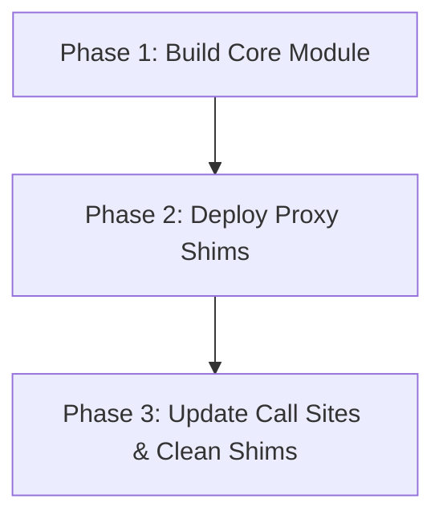

# Architecture Audit & Unified Search Module Design Proposal

## Executive Summary

This document presents a comprehensive architectural audit of all Search field implementations across the repository (`_PigmentShop`), comparing their current design with the canonical **Button Module Architecture** (`src/components/Button/`). 

Following the single public API, encapsulation, reusable foundation, and theme-resolver principles established by the Button module, this proposal outlines the unifying design for a consolidated **Search Module** in `src/components/Search/`, complete with a zero-breaking-change migration plan.

---

## 1. Audit of Search Implementations

Currently, search functionality and input UI are fragmented across **four distinct locations**:

| Implementation | File Location | Purpose / Usage | Features & Capabilities |
| :--- | :--- | :--- | :--- |
| **`GlobalSearchInput` / `SearchToolbar`** | [SearchToolbar.js](file:///d:/Magazine/_PigmentShop/src/components/SearchToolbar.js) | Standard search input container with icons. Used directly in Admin screens (Users, Products). | Container styling (`height: 50`), leading `SearchIcon`, conditional trailing clear button `IconButton`, dark/light theme inline calculation, focus border styling (`accentBlue`). |
| **`SearchInput` (SearchBar Proxy)** | [SearchInput.js](file:///d:/Magazine/_PigmentShop/src/components/SearchBar/SearchInput.js) | Adapter proxy wrapping `GlobalSearchInput`. | Wraps `SearchToolbar`, overrides `placeholder` using `t('searchPlaceholder')`, sets `returnKeyType="search"`, flex layout props. |
| **`SearchBar` (Store Header)** | [SearchBar.js](file:///d:/Magazine/_PigmentShop/src/components/SearchBar.js) | Live catalog search field with autocomplete dropdown on Storefront header. | Manages search query state, catalog indexing (`useCatalog`), auto-navigation to `/product/[id]`, focus tracking, active state callback to header (`onActiveChange`). |
| **`SearchDropdown` & `SearchResultRow`** | [SearchDropdown.js](file:///d:/Magazine/_PigmentShop/src/components/SearchBar/SearchDropdown.js) | Autocomplete suggestion overlay with navigation links. | Fixed position dropdown (`position: 'absolute'`), renders search results, empty states, and refinement hints. Uses `AnimatedButton` for list items. |

---

## 2. Comparison with Button Module Architecture

The canonical **Button Module** ([Button/index.js](file:///d:/Magazine/_PigmentShop/src/components/Button/index.js)) serves as the gold standard for component architecture in this project. 

### Key Architectural Pillars of Button Module vs Current Search Structure

| Architecture Aspect | Canonical Button Module (`src/components/Button/`) | Current Search Implementation | Gap Analysis / Deficiencies |
| :--- | :--- | :--- | :--- |
| **Public API / Barrel Export** | Clean single entry point (`index.js`) exporting primary `Button`, `IconButton`, `ChipButton`, `AnimatedButton`. | Fragmented exports across `SearchToolbar.js`, `SearchBar.js`, and `SearchBar/SearchInput.js`. | Multiple conflicting entry points; consumers import from separate top-level component files. |
| **Theme Resolution** | Abstracted hook (`useButtonTheme.js`) resolving light/dark variant styles dynamically without inline ternary logic. | Scattered theme checks (`isDark ? styles.wrapperDark : styles.wrapperLight`) mixed directly into render functions and helper utilities. | Code duplication; difficult to update theme design tokens across search inputs. |
| **Style Encapsulation** | Factory function (`ButtonStyles.js`) constructing dynamic tokens from design constants ([buttonCommon.js](file:///d:/Magazine/_PigmentShop/src/theme/buttonCommon.js)). | Split across [SearchBarStyles.js](file:///d:/Magazine/_PigmentShop/src/components/SearchBar/SearchBarStyles.js) and `StyleSheet.create` inside [SearchToolbar.js](file:///d:/Magazine/_PigmentShop/src/components/SearchToolbar.js). | Hardcoded values (e.g. `height: 50` in toolbar vs `height: 40` in `inputRow`), inconsistent padding and border colors. |
| **Foundational Composition** | Base component (`Button.js`) provides layout, focus, press animations, and loading states; variants layer on top. | `SearchInput` delegates to `SearchToolbar` which duplicates `View` + `TextInput` wrapping logic. | Inflexible composition; impossible to attach dropdowns or filters without layout hacks. |

---

## 3. Identification of Duplicated vs. Variant-Specific Logic

### What is Duplicated (Candidates for Shared Foundation):
1. **Input Container & Frame Styling:**
   - Row flex container, rounded corners (`layout.radii.md`), search icon on left, conditional clear button on right.
   - Focus state handling (border color highlight on focus).
2. **Text Input Configuration & Event Handling:**
   - Focus/blur state tracking, clearing logic (`value = ''`), text change delegation.
3. **Theme & Color Resolution:**
   - Dark/Light mode border colors, input background colors, placeholder text colors, and icon colors.

### What is Variant-Specific (To Remain Extensible Variants):
1. **Admin / Simple Toolbar Variant (`SearchInput` / `SearchField`):**
   - Pure controlled input without overlay dropdowns.
   - Size presets (`sm`, `md`, `lg`) and optional right action accessories (e.g., filter trigger buttons or result counters).
2. **Storefront Autocomplete Variant (`AutocompleteSearch` / `CatalogSearchBar`):**
   - State management for search query and focus-active states.
   - Catalog filtering logic (`useCatalog`, search token matching).
   - Absolute-positioned suggestion dropdown with keyboard handling and router navigation (`expo-router`).

---

## 4. Proposed Unified Search Module Structure

We propose creating a unified **Search Module** located at `src/components/Search/` following the standard module directory layout.

```
src/components/Search/
├── index.js                     # Single public API barrel export
├── SearchInput.js               # Shared foundational input component (SearchInput / SearchField)
├── AutocompleteSearch.js        # Autocomplete variant (wrapping SearchInput + SearchDropdown)
├── SearchDropdown.js            # Autocomplete overlay dropdown & result row component
├── SearchStyles.js              # Centralized style factory for all search components
├── useSearchTheme.js            # Theme resolver hook (dynamic light/dark token mapping)
└── searchCommon.js              # Common constants, helpers, and default props
```

### Proposed Public API (`src/components/Search/index.js`)

```javascript
export { default, default as SearchInput, SearchField } from './SearchInput';
export { default as AutocompleteSearch, SearchBar } from './AutocompleteSearch';
export { default as SearchDropdown } from './SearchDropdown';
export { useSearchTheme } from './useSearchTheme';
```

---

## 5. Detailed Component & Theme Architecture

### A. Shared Theme Resolver (`useSearchTheme.js`)
Modeled after `useButtonTheme.js`, this hook resolves color and layout tokens for container, text input, placeholder, icons, and dropdown elements:

```javascript
import { useTheme } from '../../context/ThemeContext';

export function useSearchTheme({ isDarkProp, variant = 'default', styleMap }) {
  const { isDark: isDarkContext } = useTheme();
  const isDark = isDarkProp ?? isDarkContext;
  const themeKey = isDark ? 'Dark' : 'Light';

  const container = styleMap[`container_${variant}${themeKey}`] || styleMap[`container${themeKey}`];
  const input = styleMap[`input_${variant}${themeKey}`] || styleMap[`input${themeKey}`];
  const iconColor = isDark ? colors.textMutedDark : colors.slateStrong;

  return { isDark, themeKey, container, input, iconColor };
}
```

### B. Shared Styles (`SearchStyles.js`)
Consolidates [SearchBarStyles.js](file:///d:/Magazine/_PigmentShop/src/components/SearchBar/SearchBarStyles.js) and `SearchToolbar` styles into a unified token factory using `layout.radii` and `colors`.

---

## 6. Safe 3-Phase Migration Plan

To ensure zero downtime and prevent breaking existing screens (Admin Products, Admin Users, Storefront Header), migration will be executed in three safe phases using proxy shims:



### Phase 1: Build Module Foundation (Non-Breaking)
1. Create `src/components/Search/` with `SearchStyles.js`, `useSearchTheme.js`, `searchCommon.js`.
2. Implement `SearchInput.js` as the canonical primitive input.
3. Implement `AutocompleteSearch.js` using `SearchInput` and `SearchDropdown`.
4. Create barrel export `src/components/Search/index.js`.

### Phase 2: Create Backward-Compatibility Proxy Shims
1. Update [SearchToolbar.js](file:///d:/Magazine/_PigmentShop/src/components/SearchToolbar.js) to export a proxy pointing to `src/components/Search/SearchInput`.
2. Update [SearchBar.js](file:///d:/Magazine/_PigmentShop/src/components/SearchBar.js) to export a proxy pointing to `src/components/Search/AutocompleteSearch`.
3. Update [SearchBar/SearchInput.js](file:///d:/Magazine/_PigmentShop/src/components/SearchBar/SearchInput.js) to re-export from `src/components/Search`.

### Phase 3: Consumer Refactoring & Cleanup
1. Refactor consumer imports across the codebase:
   - `src/features/shell/StoreSearchHeader.js` $\rightarrow$ import `{ AutocompleteSearch } from '@/components/Search'`
   - `src/components/Admin/Products/ProductsManager.js` $\rightarrow$ import `{ SearchInput } from '@/components/Search'`
   - `src/components/Admin/Users/UsersManager.js` $\rightarrow$ import `{ SearchInput } from '@/components/Search'`
2. Deprecate and remove legacy shim files after all imports are verified.

---

## 7. Summary of Benefits
- **Consistency:** Aligns Search field architecture 100% with the Button reference module.
- **Maintainability:** Eliminates duplicate theme branches and split style sheets across SearchToolbar and SearchBar.
- **Flexibility:** Cleanly separates pure controlled inputs from catalog autocomplete overlays.
- **Zero Risk:** Proxy shims guarantee backward compatibility during implementation.

---

## 8. Step-by-Step Execution Tasks for Phase 1 (Build Core Module)

Following the model tiering guidelines from `/ai-audit-framework`:

| Task ID | Task Description | Target Files | Complexity | Recommended Model Tier |
| :--- | :--- | :--- | :--- | :--- |
| **Task 1.1** | **Create Theme Resolver & Constants**<br>Build `searchCommon.js` and `useSearchTheme.js` modeling `useButtonTheme.js`. Define input height, padding, and dynamic dark/light color resolution logic. | [NEW] [searchCommon.js](file:///d:/Magazine/_PigmentShop/src/components/Search/searchCommon.js)<br>[NEW] [useSearchTheme.js](file:///d:/Magazine/_PigmentShop/src/components/Search/useSearchTheme.js) | Low (2/5) | 🟢 **Gemini 3.6 Flash (Low / Medium)** |
| **Task 1.2** | **Create Unified Style Factory**<br>Build `SearchStyles.js` consolidating token styles from `SearchBarStyles.js` and `SearchToolbar.js` for base input, container, clear button, and dropdown. | [NEW] [SearchStyles.js](file:///d:/Magazine/_PigmentShop/src/components/Search/SearchStyles.js) | Low (2/5) | 🟢 **Gemini 3.6 Flash (Low / Medium)** |
| **Task 1.3** | **Build Primitive `SearchInput` Component**<br>Implement canonical `SearchInput.js` primitive supporting controlled query, focus highlight, clear button, and size variants (`sm`, `md`, `lg`). | [NEW] [SearchInput.js](file:///d:/Magazine/_PigmentShop/src/components/Search/SearchInput.js) | Medium (3/5) | 🟠 **Gemini 3.6 Flash (High)** |
| **Task 1.4** | **Build Autocomplete & Dropdown Layer**<br>Port `SearchDropdown.js` and implement `AutocompleteSearch.js` encapsulating catalog indexing, navigation, and input active states. | [NEW] [SearchDropdown.js](file:///d:/Magazine/_PigmentShop/src/components/Search/SearchDropdown.js)<br>[NEW] [AutocompleteSearch.js](file:///d:/Magazine/_PigmentShop/src/components/Search/AutocompleteSearch.js) | Medium (3/5) | 🟠 **Gemini 3.6 Flash (High)** |
| **Task 1.5** | **Create Single Public Barrel Export**<br>Construct `src/components/Search/index.js` exporting `SearchInput`, `AutocompleteSearch`, `SearchDropdown`, and `useSearchTheme`. | [NEW] [index.js](file:///d:/Magazine/_PigmentShop/src/components/Search/index.js) | Low (1/5) | 🟢 **Gemini 3.6 Flash (Low)** |

