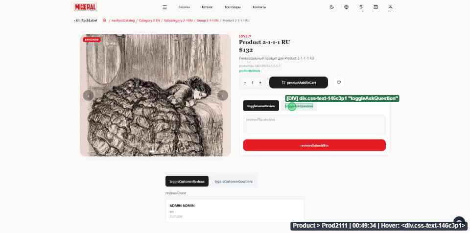
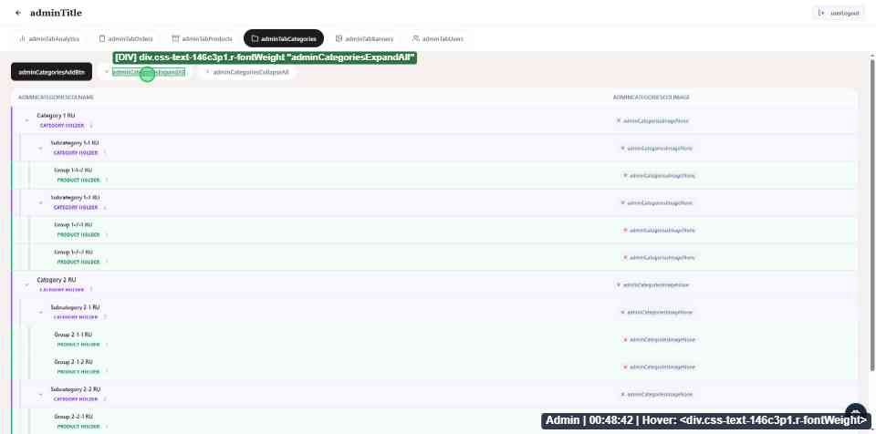
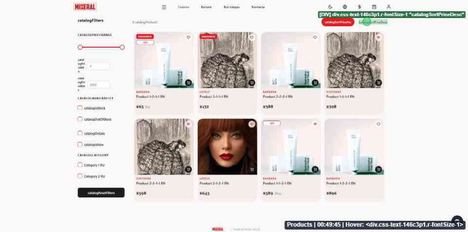
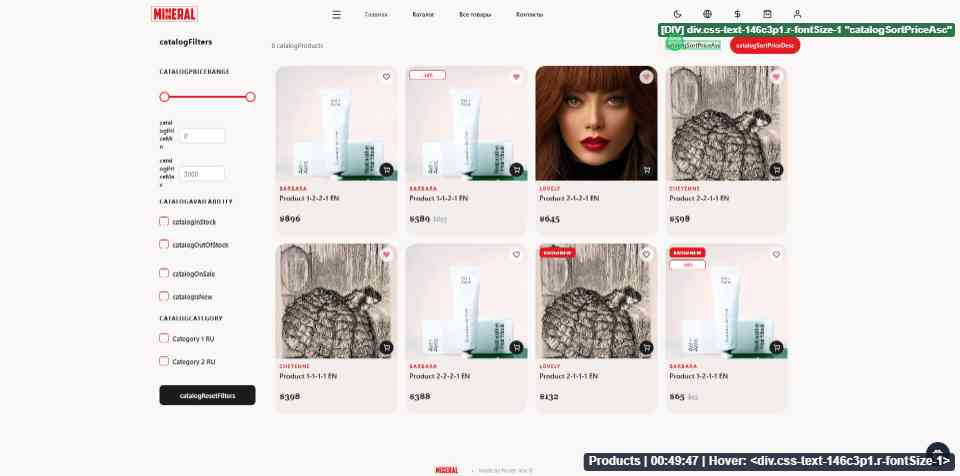
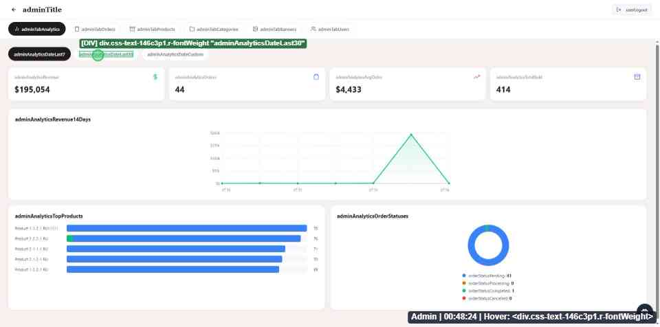
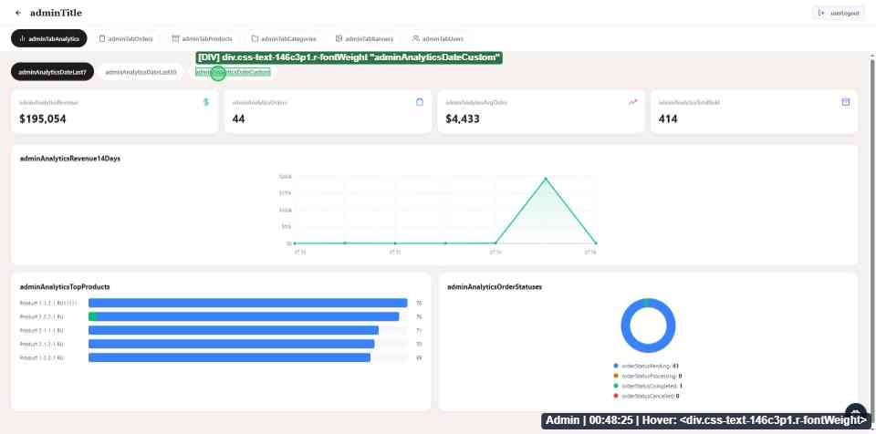
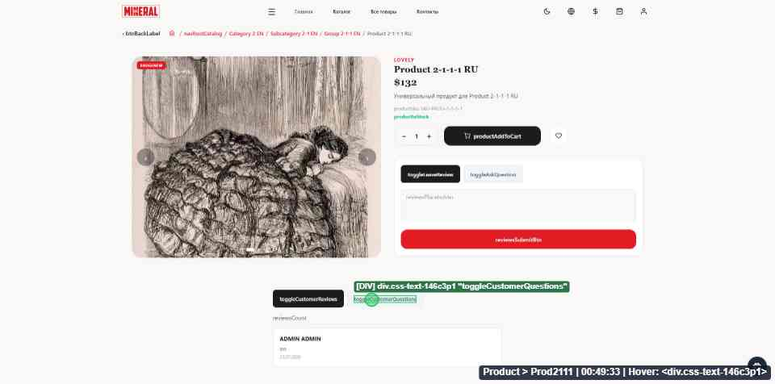
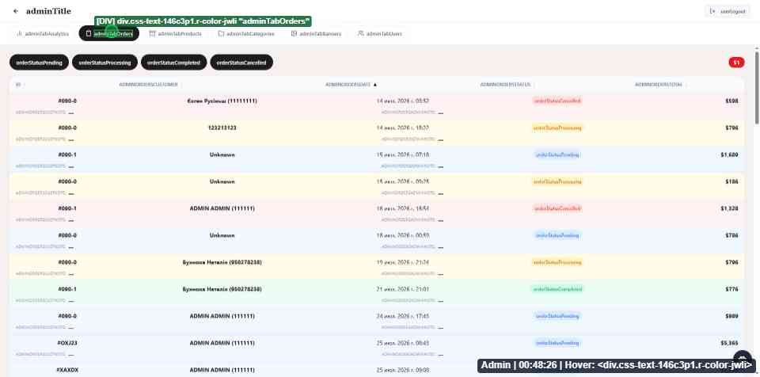
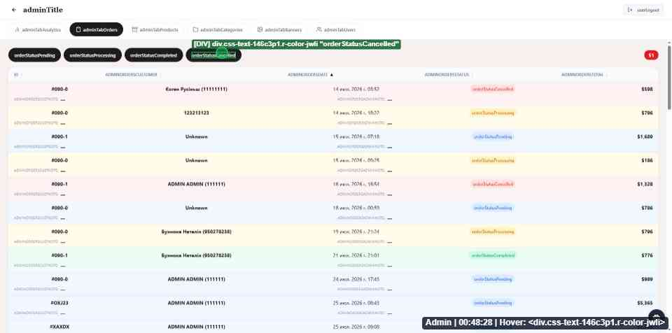
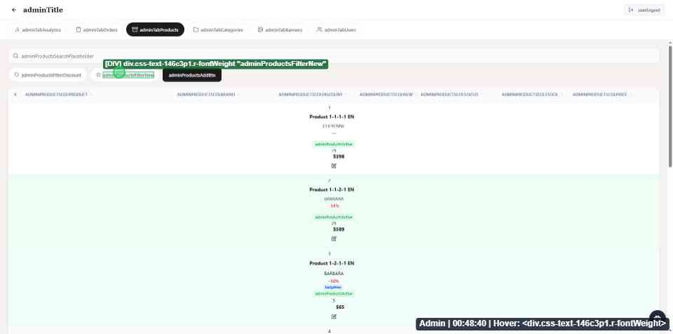

# Interactive Switchers & Controls Catalog

## Overview
This document consolidates all interactive UI elements across the application (Customer Storefront and Admin Panel), categorized strictly into three core primitives: **Button**, **Toggle**, and **Flag**.

All screenshots are stored locally in `./screenshots/` and referenced using relative Markdown syntax.

---

## 1. BUTTON (ACTION TRIGGERS & COMMANDS)

### 1.1 Form Action Trigger (Написать отзыв / Задать вопрос)
- **Semantic Primitive:** `Button` (Action Trigger)
- **Use Case:** Triggers expand/collapse state for submission forms.
- **Code Locations:** `ProductReviewSubcomponents.js` (`toggleAskQuestion`)
- **Visual Behavior:** Action button expanding/collapsing interactive form.

---

### 1.2 Tree View Expand/Collapse Control (Развернуть / Свернуть всё)
- **Semantic Primitive:** `Button` (Action Trigger)
- **Use Case:** Command triggers switching expansion state of category tree nodes.
- **Code Locations:** `CategoriesManager.js` (`adminCategoriesExpandAll`, `adminCategoriesCollapseAll`)
- **Visual Behavior:** Dual action button triggers located above category tree list.

---

### 1.3 Product Quantity Stepper Controls (`+` / `-`)
- **Semantic Primitive:** `Button` / `IconButton` (Action Trigger)
- **Use Case:** Stepper action triggers for incrementing/decrementing item quantity.
- **Code Locations:** `ProductInfoSubcomponents.js`

---

## 2. TOGGLE (MULTI-OPTION VIEW & MODE SELECTION)

### 2.1 Catalog Price Sorting Mode (Сортировка: Дешевле / Дороже)
- **Semantic Primitive:** `Toggle` (Option Selection)
- **Use Case:** Switches catalog sorting direction between low-to-high and high-to-low price.
- **Code Locations:** `CatalogFilterSidebar.js` / Catalog Header (`catalogSortPriceAsc`, `catalogSortPriceDesc`)
- **Visual Behavior:** Pill/badge with high contrast background indicating active sorting mode.

---

### 2.2 Admin Analytics Date Range Selector (Фильтр периода аналитики)
- **Semantic Primitive:** `Toggle` (Option Selection)
- **Use Case:** Switches date preset filter for analytics metrics (7 Days / 30 Days / Custom).
- **Code Locations:** `DateRangeCalendar.js` (`adminAnalyticsDateLast7`, `adminAnalyticsDateLast30`, `adminAnalyticsDateCustom`)
- **Visual Behavior:** Horizontal pill elements with black background for active option.

---

### 2.3 Product Content View Selector (Отзывы / Вопросы покупателей)
- **Semantic Primitive:** `Toggle` (View Selection)
- **Use Case:** Switches between viewing Customer Reviews and Customer Questions on product detail page.
- **Code Locations:** Product Detail View (`toggleCustomerReviews`, `toggleCustomerQuestions`)
- **Visual Behavior:** Segmented pill pair where active tab has dark background (`#000000`) and white text.

---

### 2.4 Admin Header Module Navigation Tabs
- **Semantic Primitive:** `Toggle` / `Tab` (View Selection)
- **Use Case:** Switches active admin module (Analytics, Orders, Products, Categories, Banners, Users).
- **Code Locations:** `AdminTabBar.js` (`adminTabAnalytics`, `adminTabOrders`, `adminTabProducts`, `adminTabCategories`, `adminTabBanners`, `adminTabUsers`)
- **Visual Behavior:** Pill with icon + label. Active: Solid black background. Inactive: Faint gray pill border.

---

## 3. FLAG (BOOLEAN ATTRIBUTE SWITCHES & FILTER BADGES)

### 3.1 Admin Order Status Filter (Фильтры статусов заказов)
- **Semantic Primitive:** `Flag` / `FlagGroup` (Boolean Attribute Filter)
- **Use Case:** Filters order lists by status (Pending / Processing / Completed / Cancelled).
- **Code Locations:** `OrdersManager.js` (`orderStatusPending`, `orderStatusProcessing`, `orderStatusCompleted`, `orderStatusCancelled`)
- **Visual Behavior:** Row of rounded attribute pills. Active status pill is highlighted in solid black.

---

### 3.2 Admin Product Attribute Filter (Со скидкой / Новинки)
- **Semantic Primitive:** `Flag` (Boolean Attribute Switch)
- **Use Case:** Switches product list filtering by "Discount" or "New Arrival" attribute.
- **Code Locations:** `ProductsManager.js` (`adminProductsFilterDiscount`, `adminProductsFilterNew`)
- **Visual Behavior:** Compact chip switchers located above products table.

---

### 3.3 Theme & Preference Switcher (Светлая / Тёмная тема)
- **Semantic Primitive:** `Flag` (Boolean State Switch)
- **Use Case:** Color theme switcher (Light / Dark mode toggle).
- **Code Locations:** `AppHeaderControls.js`

---

### 3.4 Form Checkboxes
- **Semantic Primitive:** `Flag` (Boolean Input)
- **Use Case:** Boolean checkbox state inputs in admin forms.
- **Code Locations:** [`ProductFormFields.js`](file:///d:/Magazine/_PigmentShop/src/components/Admin/Products/ProductFormFields.js#L13-L22) (`FieldCheckbox`)
