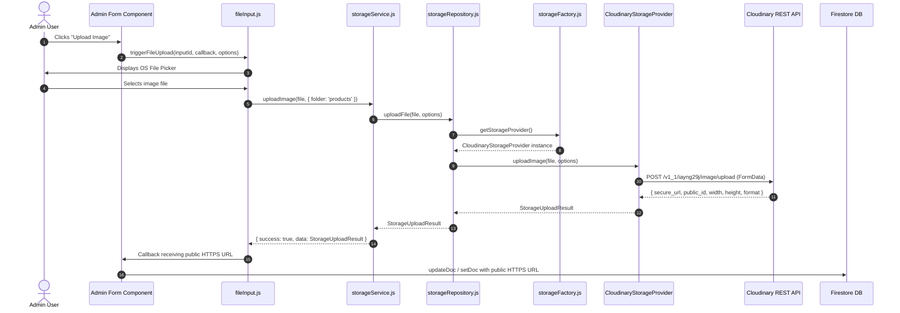

# Image Storage Subsystem & Storage Provider Architecture

> **Canonical Developer Documentation**  
> System: Pigment Shop Image Storage Subsystem  
> Location: `src/services/storage/` & `src/services/storageService.js`

---

## 1. Executive Summary & Purpose

The **Image Storage Subsystem** provides a vendor-agnostic abstraction for storing, resolving, uploading, and deleting media assets across the Pigment Shop e-commerce platform.

While **Firebase** remains the primary infrastructure for Authentication, Firestore Database, and Application State, image storage is decoupled using a pluggable **Storage Provider Architecture**. 

- **Active Production Backend**: Cloudinary (Unsigned mode, Cloud Name `iayng29j`).
- **Future-Proofing**: Supports swapping to Firebase Storage, AWS S3, or Cloudflare R2 via environment configuration without modifying any UI components, feature modules, or database contracts.

---

## 2. Overall Architecture & Layering

The storage subsystem adheres strictly to the project's layered service architecture standard (`.docs/architecture-standards/services/_reference-service-spec.md`):

```text
┌────────────────────────────────────────────────────────────────────────┐
│ UI & Presentation Layer (Admin Forms / Product Cards / Storefront)     │
└───────────────────────────────────┬────────────────────────────────────┘
                                    │
                                    ▼
┌────────────────────────────────────────────────────────────────────────┐
│ Domain Service Layer (src/services/storageService.js)                   │
│ - Wrapped with withServiceContract                                     │
│ - Returns canonical { success, data, error } payloads                  │
└───────────────────────────────────┬────────────────────────────────────┘
                                    │
                                    ▼
┌────────────────────────────────────────────────────────────────────────┐
│ Repository Layer (src/services/repositories/storageRepository.js)     │
│ - Functional query/mutation handlers (throws raw exceptions)           │
└───────────────────────────────────┬────────────────────────────────────┘
                                    │
                                    ▼
┌────────────────────────────────────────────────────────────────────────┐
│ Provider Factory (src/services/storage/storageFactory.js)              │
│ - Resolves active provider based on EXPO_PUBLIC_STORAGE_PROVIDER       │
└───────────────────┬───────────────────────────────┬────────────────────┘
                    │                               │
                    ▼                               ▼
┌───────────────────────────────────────┐ ┌──────────────────────────────┐
│ Cloudinary Storage Provider           │ │ Firebase Storage Provider    │
│ (src/services/storage/providers/     │ │ (src/services/storage/       │
│  cloudinaryStorageProvider.js)        │ │  providers/firebase...)      │
└───────────────────────────────────────┘ └──────────────────────────────┘
```

---

## 3. Design Decisions & Rationale

### 3.1 Why an Abstraction Layer Exists
1. **Vendor Lock-in Prevention**: Directly coupling UI components (`CategoryFormFields`, `ProductFormFields`, `BannersManager`) to Cloudinary APIs or Firebase SDKs would make future backend migrations costly and error-prone.
2. **Standardized Return Payloads**: All image upload operations return a normalized `StorageUploadResult` containing public HTTPS URLs, width, height, format, and bytes.
3. **Database Security & Performance**: Storing raw base64 data URLs in Firestore document fields leads to Firestore document size limit errors (1MB max). The Storage Service guarantees that only lightweight, CDN-accelerated HTTPS URLs are saved to database entities.

---

## 4. Subsystem Directory & Module Responsibilities

```text
src/services/
├── storageService.js                 # High-level domain service (withServiceContract wrapped)
├── repositories/
│   └── storageRepository.js          # Low-level storage repository (throwing layer)
└── storage/
    ├── README.md                     # This canonical documentation file
    ├── storageConfig.js              # Environment variable configuration & defaults
    ├── storageFactory.js             # Singleton factory resolving active provider
    └── providers/
        ├── baseStorageProvider.js    # Abstract base class interface (IStorageProvider)
        ├── cloudinaryStorageProvider.js # Cloudinary REST API implementation
        ├── firebaseStorageProvider.js   # Firebase Storage SDK implementation
        └── localStorageProvider.js     # Dev/offline fallback provider
```

### Module Responsibilities

| Module File | Responsibility |
| :--- | :--- |
| `storageConfig.js` | Parses `process.env` configuration for `EXPO_PUBLIC_STORAGE_PROVIDER`, Cloudinary credentials, and fallback defaults. |
| `baseStorageProvider.js` | Defines abstract base class interface (`uploadImage`, `deleteImage`, `resolveUrl`) and JSDoc type definitions (`StorageUploadOptions`, `StorageUploadResult`). |
| `storageFactory.js` | Caches and dispatches singleton provider instances (`cloudinary`, `firebase`, `local`). |
| `cloudinaryStorageProvider.js` | Performs `POST` requests to `https://api.cloudinary.com/v1_1/<cloud_name>/image/upload` via `FormData`, parsing returned secure URLs and resolving dynamic transformations (`w_400,q_80`). |
| `firebaseStorageProvider.js` | Interacts with `firebase/storage` SDK (`uploadBytes`, `getDownloadURL`, `deleteObject`). |
| `localStorageProvider.js` | Handles relative `/media/...` asset paths and data URIs for local testing. |
| `storageRepository.js` | Functions as the low-level data layer executing provider methods without error trapping. |
| `storageService.js` | Wraps async repository calls with `withServiceContract` and exports synchronous `resolveImageUrl`. |
| `src/media/mediaAdapter.js` | Delegates `resolveMediaUrl` to `storageService.resolveImageUrl` for platform-wide asset resolution. |
| `src/utils/fileInput.js` | Provides `triggerFileUpload` to capture browser file selection and upload via `storageService`. |

---

## 5. End-to-End Request Flows

### 5.1 Image Upload Flow (Admin Panel -> Cloudinary -> Firestore)



### 5.2 Image Rendering Flow (Storefront Card -> MediaAdapter -> CDN)

```text
Storefront Component (ProductCard / CategoryCard)
       │
       ▼
src/media/mediaAdapter.js (resolveMediaUrl)
       │
       ▼
src/services/storageService.js (resolveImageUrl)
       │
       ▼
src/services/repositories/storageRepository.js (resolveUrl)
       │
       ▼
CloudinaryStorageProvider.resolveUrl(publicIdOrUrl, options)
       │
       ├── Is HTTP / HTTPS / Data URI? ────► Return as-is
       ├── Is legacy static folder? ─────────► Return /media/<path>
       └── Is Cloudinary Public ID? ─────────► Construct https://res.cloudinary.com/iayng29j/image/upload/<transforms>/<public_id>
```

---

## 6. Configuration & Environment Setup

Add the following environment variables to your `.env` or `.env.local` file:

```ini
# Storage Provider Selection ('cloudinary' | 'firebase' | 'local')
EXPO_PUBLIC_STORAGE_PROVIDER=cloudinary

# Cloudinary Configuration
EXPO_PUBLIC_CLOUDINARY_CLOUD_NAME=iayng29j
EXPO_PUBLIC_CLOUDINARY_API_KEY=243111452156969
EXPO_PUBLIC_CLOUDINARY_UPLOAD_PRESET=pigment_shop
```

---

## 7. Placeholder Management & Default Uploads

Default placeholder images (`_default_product_card.jpg` and `_default_catalog_card.jpg`) are hosted on Cloudinary:

- **Product Default Placeholder**: `https://res.cloudinary.com/iayng29j/image/upload/v1785611320/products/tjlw5jitzfkoaqfmj7ti.jpg`
- **Category Default Placeholder**: `https://res.cloudinary.com/iayng29j/image/upload/v1785611322/categories/g3yabymukhht0e8zeyc7.jpg`

These are referenced globally in `src/constants/index.js`:

```javascript
export const PRODUCT_PLACEHOLDER = 'https://res.cloudinary.com/iayng29j/image/upload/v1785611320/products/tjlw5jitzfkoaqfmj7ti.jpg';
export const CATEGORY_PLACEHOLDER = 'https://res.cloudinary.com/iayng29j/image/upload/v1785611322/categories/g3yabymukhht0e8zeyc7.jpg';
```

---

## 8. Provider Swap Guide (Cloudinary to Firebase Storage)

To switch the entire application from Cloudinary to Firebase Storage:

1. Open `.env` and change `EXPO_PUBLIC_STORAGE_PROVIDER`:
   ```ini
   EXPO_PUBLIC_STORAGE_PROVIDER=firebase
   ```
2. Verify Firebase Cloud Storage is initialized in `src/services/firebase/index.js`.
3. Restart the dev server (`npm run dev`).

**No code modifications are required in UI components, domain services, or database transformers.**

---

## 9. Adding a New Storage Provider (e.g. AWS S3 / Cloudflare R2)

1. **Create Provider File**: Create `src/services/storage/providers/s3StorageProvider.js` extending `BaseStorageProvider`.
2. **Implement Methods**:
   ```javascript
   import { BaseStorageProvider } from './baseStorageProvider.js';

   export class S3StorageProvider extends BaseStorageProvider {
     async uploadImage(file, options = {}) { /* S3 PutObject logic */ }
     async deleteImage(publicIdOrUrl) { /* S3 DeleteObject logic */ }
     resolveUrl(publicIdOrUrl, options = {}) { /* S3 CloudFront CDN URL resolution */ }
   }
   ```
3. **Register in Factory**: Add case `'s3'` to `src/services/storage/storageFactory.js`.
4. **Register in Config**: Add `S3: 's3'` to `STORAGE_PROVIDERS` in `storageConfig.js`.

---

## 10. Verification & Automated Testing

Run the automated verification suite to validate all providers and service contracts:

```bash
node .tools/scripts/test-storage-provider.mjs
```

### Test Suite Checklist
- [x] Configuration loading & active default provider resolution.
- [x] `LocalStorageProvider` fallback upload & `/media/` path resolution.
- [x] `CloudinaryStorageProvider` REST upload, transformation URL building, and legacy path preservation.
- [x] `FirebaseStorageProvider` interface compliance.
- [x] `storageService` contract error handling (`withServiceContract`).
- [x] Production Cloudinary placeholder image HTTP 200 reachability check.
